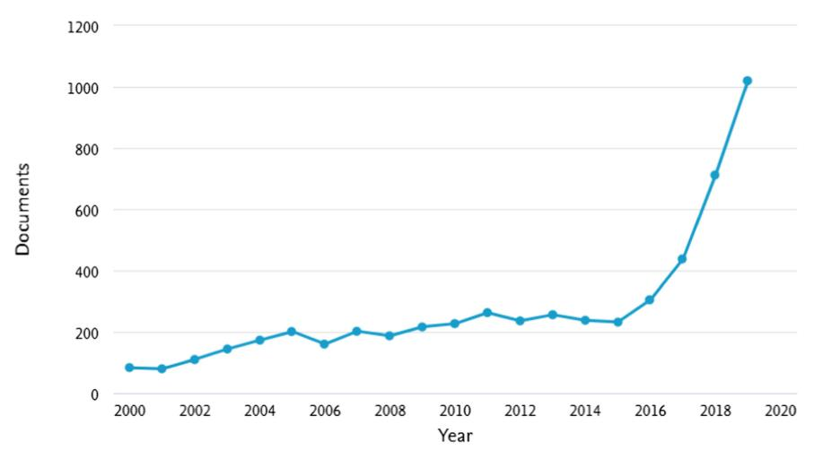
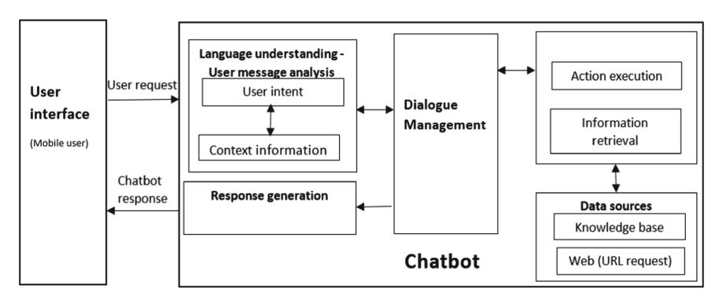

# **An Overview of Chatbot Technology**

Eleni Adamopoulou(B) and Lefteris Moussiade[s](http://orcid.org/0000-0003-0281-9231)

Department of Computer Science, International Hellenic University, Agios Loukas, 65404 Kavala, Greece

{eladamo,lmous}@cs.ihu.gr

**Abstract.** The use of chatbots evolved rapidly in numerous fields in recent years, including Marketing, Supporting Systems, Education, Health Care, Cultural Heritage, and Entertainment. In this paper, we first present a historical overview of the evolution of the international community's interest in chatbots. Next, we discuss the motivations that drive the use of chatbots, and we clarify chatbots' usefulness in a variety of areas. Moreover, we highlight the impact of social stereotypes on chatbots design. After clarifying necessary technological concepts, we move on to a chatbot classification based on various criteria, such as the area of knowledge they refer to, the need they serve and others. Furthermore, we present the general architecture of modern chatbots while also mentioning the main platforms for their creation. Our engagement with the subject so far, reassures us of the prospects of chatbots and encourages us to study them in greater extent and depth.

**Keywords:** Chatbot · Chatbot architecture · Artificial Intelligence · Machine learning · NLU

### **1 Introduction**

Artificial Intelligence (AI) increasingly integrates our daily lives with the creation and analysis of intelligent software and hardware, called intelligent agents. Intelligent agents can do a variety of tasks ranging from labor work to sophisticated operations. A chatbot is a typical example of an AI system and one of the most elementary and widespread examples of intelligent Human-Computer Interaction (HCI) [\[1\]](#page-8-0). It is a computer program, which responds like a smart entity when conversed with through text or voice and understands one or more human languages by Natural Language Processing (NLP) [\[2\]](#page-8-1). In the lexicon, a chatbot is defined as "A computer program designed to simulate conversation with human users, especially over the Internet" [\[3\]](#page-8-2). Chatbots are also known as smart bots, interactive agents, digital assistants, or artificial conversation entities.

Chatbots can mimic human conversation and entertain users but they are not built only for this. They are useful in applications such as education, information retrieval, business, and e-commerce [\[4\]](#page-8-3). They became so popular because there are many advantages of chatbots for users and developers too. Most implementations are platform-independent and instantly available to users without needed installations. Contact to the chatbot is spread through a user's social graph without leaving the messaging app the chatbot lives in, which provides and guarantees the user's identity. Moreover, payment services are integrated into the messaging system and can be used safely and reliably and a notification system re-engages inactive users. Chatbots are integrated with group conversations or shared just like any other contact, while multiple conversations can be carried forward in parallel. Knowledge in the use of one chatbot is easily transferred to the usage of other chatbots, and there are limited data requirements. Communication reliability, fast and uncomplicated development iterations, lack of version fragmentation, and limited design efforts for the interface are some of the advantages for developers too [\[5\]](#page-8-4).

The rest of the paper is organized as follows. In Sect. [2,](#page-1-0) we briefly present the history of chatbots and highlight the growing interest of the research community. In Sect. [3,](#page-2-0) some issues about the association with chatbots are discussed, while in Sect. [4,](#page-3-0) essential concepts relevant to chatbot technology are described. Next, in Sect. [5,](#page-4-0) we present a classification of existing chatbots while in Sect. [6,](#page-6-0) we present the underlying chatbot architecture and the leading platforms for their development. Finally, Sect. [7](#page-7-0) reports conclusions and highlights further research topics.

## <span id="page-1-0"></span>**2 History**

Alan Turing in 1950 proposed the Turing Test ("Can machines think?"), and it was at that time that the idea of a chatbot was popularized [\[6\]](#page-8-5). The first known chatbot was Eliza, developed in 1966, whose purpose was to act as a psychotherapist returning the user utterances in a question form [\[7\]](#page-8-6). It used simple pattern matching [\[8\]](#page-8-7) and a templatebased response mechanism. Its conversational ability was not good, but it was enough to confuse people at a time when they were not used to interacting with computers and give them the impetus to start developing other chatbots [\[5\]](#page-8-4). An improvement over ELIZA was a chatbot with a personality named PARRY developed in 1972 [\[9\]](#page-8-8). In 1995, the chatbot ALICE was developed which won the Loebner Prize, an annual Turing Test, in years 2000, 2001, and 2004. It was the first computer to gain the rank of the "most human computer" [\[10\]](#page-8-9). ALICE relies on a simple pattern-matching algorithm with the underlying intelligence based on the Artificial Intelligence Markup Language (AIML) [\[11\]](#page-8-10), which makes it possible for developers to define the building blocks of the chatbot knowledge [\[10\]](#page-8-9). Chatbots, like SmarterChild [\[12\]](#page-8-11) in 2001, were developed and became available through messenger applications. The next step was the creation of virtual personal assistants like Apple Siri [\[13\]](#page-9-0), Microsoft Cortana [\[14\]](#page-9-1), Amazon Alexa [\[15\]](#page-9-2), Google Assistant [\[16\]](#page-9-3) and IBM Watson [\[17\]](#page-9-4).

As shown in Fig. [1](#page-2-1) according to Scopus [\[18\]](#page-9-5), there was a rapid growth of interest in chatbots especially after the year 2016. Many chatbots were developed for industrial solutions while there is a wide range of less famous chatbots relevant to research and their applications [\[19\]](#page-9-6).



<span id="page-2-1"></span>**Fig. 1.** Search results in Scopus by year for "chatbot" or "conversation agent" or "conversational interface" as keywords from 2000 to 2019.

## <span id="page-2-0"></span>**3 Associate with Chatbots**

Why do users use chatbots? Chatbots seem to hold tremendous promise for providing users with quick and convenient support responding specifically to their questions. The most frequent motivation for chatbot users is considered to be productivity, while other motives are entertainment, social factors, and contact with novelty. However, to balance the motivations mentioned above, a chatbot should be built in a way that acts as a tool, a toy, and a friend at the same time [\[8\]](#page-8-7).

The reduction in customer service costs and the ability to handle many users at a time are some of the reasons why chatbots have become so popular in business groups [\[20\]](#page-9-7). Chatbots are no longer seen as mere assistants, and their way of interacting brings them closer to users as friendly companions [\[21\]](#page-9-8). According to a study, social media user requests on chatbots for customer service are emotional and informational, with the first category rate being more than 40% and with users not intending to take specific information [\[22\]](#page-9-9). Machine learning is what gives the capability to customer service chatbots for sentiment detection and also the ability to relate to customers emotionally as human operators do [\[23\]](#page-9-10).

Concerning the user's trust in chatbots, it depends on factors relative to the chatbot itself, like how much it responds like a human, how it is self-presented, and how much professional its appearance is. Nevertheless, it depends also on factors relative to its service contexts, like the brand of the chatbot host, privacy and security in the chatbot, and other risk issues about the topic of the request [\[10\]](#page-8-9). Human-likeness can be suggested by using human figures (visual cues), human-associated names, or identity (identity cues) and mimicking of human languages (conversational cues) [\[24\]](#page-9-11). It has already been studied the influence of personification and interactivity in people's disclosures around sensitive topics, such as psychological stressors [\[25\]](#page-9-12). Important to mention is that chatbots still lack empathy understanding meaning and that they are not as capable as humans of understanding conversational undertones. Though progress has been made in this field, and soon machines will not only be able to understand what somebody is saying but also what is the feeling of what he is saying [\[26\]](#page-9-13).

However, a biased view of gender is revealed, as most of the chatbots perform tasks that echo historically feminine roles and articulate these features with stereotypical behaviors. Accordingly, general or specialized chatbots automate work that is coded as female, given that they mainly operate in service or assistance related contexts, acting as personal assistants or secretaries [\[21\]](#page-9-8).

Soon we will live in a world where conversational partners will be humans or chatbots, and in many cases, we will not know and will not care what our conversational partner will be [\[27\]](#page-9-14).

# <span id="page-3-0"></span>**4 Essential Concepts**

Below are some fundamental concepts related to chatbot technology.

**Pattern Matching** is predicated on representative stimulus-response blocks. A sentence (stimuli) is entered, and output (response) is created consistent with the user input [\[11\]](#page-8-10). Eliza and ALICE were the first chatbots developed using pattern recognition algorithms. The disadvantage of this approach is that the responses are entirely predictable, repetitive, and lack the human touch. Also, there is no storage of past responses, which can lead to looping conversations [\[28\]](#page-9-15).

The **Artificial Intelligence Markup Language (AIML)** was created from 1995 to 2000, and it is based on the concepts of Pattern Recognition or Pattern Matching technique. It is applied to natural language modeling for the dialogue between humans and chatbots that follow the stimulus-response approach. It is an XML-based markup language and it is tag-based. As shown in Fig. [2,](#page-3-1) AIML is based on basic units of dialogue called categories (tag *<*category*>*) which are formed by user input patterns (tag *<*pattern*>*) and chatbot responses (tag *<*template*>*) [\[11\]](#page-8-10).

```
<aiml version="1.0.1" encoding="UTF-8"?>
  <category> 
     <pattern> My name is * and I am * years old </pattern>
     <template> Hello <star/>. I am also <star index="2"/> years old!</template>
  </category>
</aiml>
```

**Fig. 2.** Example of AIML code

<span id="page-3-1"></span>**Latent Semantic Analysis (LSA)** may be used together with AIML for the development of chatbots. It is used to discover likenesses between words as vector representation [\[29\]](#page-9-16). Template-based questions like greetings and general questions can be answered using AIML while other unanswered questions use LSA to give replies [\[30\]](#page-9-17).

**Chatscript**, being the successor of the AIML language, is an expert system, which consists of an open-source scripting language and the engine that runs it. It is comprised of rules which are associated with topics, finding the best item that matches the user query string and executing a rule in that topic. Chatscript also includes long-term memory in the form of \\$ variables which can be used to store specific user information like the name or age of the user. It is also case-sensitive, widening the possible responses that can be given to the same user input based on the intended emotion, as uppercase is typically used in conversations to indicate emphasis [\[28\]](#page-9-15).

**RiveScript** is a plain text, line-based scripting language for the development of chatbots and other conversational entities. It is open-source with available interfaces for Go, Java, JavaScript, Perl, and Python [\[31\]](#page-9-18).

**Natural Language Processing (NLP)**, an area of artificial intelligence, explores the manipulation of natural language text or speech by computers. Knowledge of the understanding and use of human language is gathered to develop techniques that will make computers understand and manipulate natural expressions to perform desired tasks [\[32\]](#page-9-19). Most NLP techniques are based on machine learning.

**Natural Language Understanding (NLU)** is at the core of any NLP task. It is a technique to implement natural user interfaces such as a chatbot. NLU aims to extract context and meanings from natural language user inputs, which may be unstructured and respond appropriately according to user intention [\[32\]](#page-9-19). It identifies user intent and extracts domain-specific entities. More specifically, an **intent** represents a mapping between what a user says and what action should be taken by the chatbot. Actions correspond to the steps the chatbot will take when specific intents are triggered by user inputs and may have parameters for specifying detailed information about it [\[28\]](#page-9-15). Intent detection is typically formulated as sentence classification in which single or multiple intent labels are predicted for each sentence [\[32\]](#page-9-19).

An **entity** is a tool for extracting parameter values from natural language inputs. For example, consider the sentence "What is the weather in Greece?". The user intent is to learn the weather forecast. The entity value is Greece. Therefore, the user asks for the weather forecast in Greece [\[33\]](#page-9-20). Entities can be either system-defined or developerdefined. For example, the system entity @sys.date corresponds to standard date references like 10 August 2019 or the 10th of August [\[28\]](#page-9-15). Domain entity extraction usually referred to as a slot-filling problem, is formulated as a sequential tagging problem where parts of a sentence are extracted and tagged with domain entities [\[32\]](#page-9-19).

Finally, **contexts** are strings that store the context of the object the user is referring to or talking about. For example, a user might refer to a previously defined object in his following sentence. A user may input "Switch on the fan." Here the context to be saved is the fan so that when a user says, "Switch it off" as the next input, the intent "switch off" may be invoked on the context "fan" [\[28\]](#page-9-15).

## <span id="page-4-0"></span>**5 Types of Chatbots**

Chatbots can be classified using different parameters: the knowledge domain, the service provided, the goals, the input processing and response generation method, the human-aid, and the build method.

Classification based on the **knowledge domain** considers the knowledge a chatbot can access or the amount of data it is trained upon. **Open domain** chatbots can talk about general topics and respond appropriately, while **closed domain** chatbots are focused on a particular knowledge domain and might fail to respond to other questions [\[34\]](#page-9-21).

Classification based on the **service provided** considers the sentimental proximity of the chatbot to the user, the amount of intimate interaction that takes place, and it is also dependent upon the task the chatbot is performing. **Interpersonal** chatbots lie in the domain of communication and provide services such as Restaurant booking, Flight booking, and FAQ bots. They are not companions of the user, but they get information and pass them on to the user. They can have a personality, can be friendly, and will probably remember information about the user, but they are not obliged or expected to do so. **Intrapersonal** chatbots exist within the personal domain of the user, such as chat apps like Messenger, Slack, and WhatsApp. They are companions to the user and understand the user like a human does.**Inter-agent** chatbots become omnipresent while all chatbots will require some inter-chatbot communication possibilities. The need for protocols for inter-chatbot communication has already emerged. Alexa-Cortana integration is an example of inter-agent communication [\[34\]](#page-9-21).

Classification based on the **goals** considers the primary goal chatbots aim to achieve. **Informative** chatbots are designed to provide the user with information that is stored beforehand or is available from a fixed source, like FAQ chatbots. **Chatbased/Conversational** chatbots talk to the user, like another human being, and their goal is to respond correctly to the sentence they have been given.**Task-based** chatbots perform a specific task such as booking a flight or helping somebody. These chatbots are intelligent in the context of asking for information and understanding the user's input. Restaurant booking bots and FAQ chatbots are examples of Task-based chatbots [\[34,](#page-9-21) [35\]](#page-9-22).

Classification based on the **input processing and response generation method** takes into account the method of processing inputs and generating responses. There are three models used to produce the appropriate responses: **rule-based** model, **retrievalbased** model, and **generative** model [\[36\]](#page-10-0).

**Rule-based** model chatbots are the type of architecture which most of the first chatbots have been built with, like numerous online chatbots. They choose the system response based on a fixed predefined set of rules, based on recognizing the lexical form of the input text without creating any new text answers. The knowledge used in the chatbot is humanly hand-coded and is organized and presented with conversational patterns [\[28\]](#page-9-15). A more comprehensive rule database allows the chatbot to reply to more types of user input. However, this type of model is not robust to spelling and grammatical mistakes in user input. Most existing research on rule-based chatbots studies response selection for single-turn conversation, which only considers the last input message. In more humanlike chatbots, multi-turn response selection takes into consideration previous parts of the conversation to select a response relevant to the whole conversation context [\[37\]](#page-10-1).

A little different from the rule-based model is the **retrieval-based** model, which offers more flexibility as it queries and analyzes available resources using APIs [\[36\]](#page-10-0). A retrieval-based chatbot retrieves some response candidates from an index before it applies the matching approach to the response selection [\[37\]](#page-10-1).

The **generative** model generates answers in a better way than the other three models, based on current and previous user messages. These chatbots are more human-like and use machine learning algorithms and deep learning techniques. However, there are difficulties in building and training them [\[36\]](#page-10-0).

Another classification for chatbots considers the amount of **human-aid** in their components. **Human-aided** chatbots utilize human computation in at least one element from the chatbot. Crowd workers, freelancers, or full-time employees can embody their intelligence in the chatbot logic to fill the gaps caused by limitations of fully automated chatbots. While human computation, compared to rule-based algorithms and machine learning, provides more flexibility and robustness, still, it cannot process a given piece of information as fast as a machine, which makes it hard to scale to more user requests [\[35\]](#page-9-22).

Chatbots can also be classified according to the permissions provided by their development platform. Development platforms can be of open-source, such as RASA, or can be of proprietary code such as development platforms typically offered by large companies such as Google or IBM. **Open-source platforms** provide the chatbot designer with the ability to intervene in most aspects of implementation. **Closed platforms**, typically act as black boxes, which may be a significant disadvantage depending on the project requirements. However, access to state-of-the-art technologies may be considered more immediate for large companies. Moreover, one may assume that chatbots developed based on large companies' platforms may be benefited by a large amount of data that these companies collect.

Of course, chatbots do not exclusively belong to one category or another, but these categories exist in each chatbot in varying proportions.

## <span id="page-6-0"></span>**6 Design and Development**

The design and development of a chatbot involve a variety of techniques [\[29\]](#page-9-16). Understanding what the chatbot will offer and what category falls into helps developers pick the algorithms or platforms and tools to build it. At the same time, it also helps the end-users understand what to expect [\[34\]](#page-9-21).

The requirements for designing a chatbot include accurate knowledge representation, an answer generation strategy, and a set of predefined neutral answers to reply when user utterance is not understood [\[38\]](#page-10-2). The first step in designing any system is to divide it into constituent parts according to a standard so that a modular development approach can be followed [\[28\]](#page-9-15). In Fig. [3,](#page-7-1) a general chatbot architecture is introduced.

The process starts with a user's request, for example, "What is the meaning of environment?", to the chatbot using a messenger app like Facebook, Slack, WhatsApp, WeChat or Skype, or an app using text or speech input like Amazon Echo [\[39\]](#page-10-3).

After the chatbot receives the user request, the Language Understanding Component parses it to infer the user's intention and the associated information (intent: "translate," entities: [word: "environment"]) [\[35\]](#page-9-22).

Once a chatbot reaches the best interpretation it can, it must determine how to proceed [\[40\]](#page-10-4). It can act upon the new information directly, remember whatever it has understood and wait to see what happens next, require more context information or ask for clarification.

When the request is understood, action execution and information retrieval take place. The chatbot performs the requested actions or retrieves the data of interest from



**Fig. 3.** General chatbot architecture

<span id="page-7-1"></span>its data sources, which may be a database, known as the Knowledge Base of the chatbot, or external resources that are accessed through an API call [\[35\]](#page-9-22).

Upon retrieval, the Response Generation Component uses Natural Language Generation (NLG) [\[41\]](#page-10-5) to prepare a natural language human-like response to the user based on the intent and context information returned from the user message analysis component. The appropriate responses are produced by one of the three models mentioned in Sect. [5](#page-4-0) of the paper: rule-based, retrieval based, and generative model [\[36\]](#page-10-0).

A Dialogue Management Component keeps and updates the context of a conversation which is the current intent, identified entities, or missing entities required to fulfill user requests. Moreover, it requests missing information, processes clarifications by users, and asks follow-up questions. For example, the chatbot may respond: "Would you like to tell me as well an example sentence with the word environment?" [\[35\]](#page-9-22).

Many commercial and open-source options are available for the development of a chatbot. The number of chatbot-related technologies is already overwhelming and growing each day [\[42\]](#page-10-6). Chatbots are developed in two ways: using any programming language like Java, Clojure, Python, C++, PHP, Ruby, and Lisp or using state-of-the-art platforms. At this time, we are distinguishing six leading NLU cloud platforms that developers can use to create applications able to understand natural languages: Google's DialogFlow [\[43\]](#page-10-7), Facebook's wit.ai [\[44\]](#page-10-8), Microsoft LUIS [\[45\]](#page-10-9), IBM Watson Conversation [\[17\]](#page-9-4), Amazon Lex [\[46\]](#page-10-10), and SAP Conversation AI [\[47\]](#page-10-11). All these platforms are supported by machine learning. They share some standard functionality (they are cloud-based, they support various programming and natural languages) but differ significantly in other aspects [\[33\]](#page-9-20). Other known chatbot development platforms are RASA [\[48\]](#page-10-12), Botsify [\[49\]](#page-10-13), Chatfuel [\[50\]](#page-10-14), Manychat [\[51\]](#page-10-15), Flow XO [\[52\]](#page-10-16), Chatterbot [\[53\]](#page-10-17), Pandorabots [\[54\]](#page-10-18), Botkit [\[55\]](#page-10-19), and Botlytics [\[56\]](#page-10-20).

#### <span id="page-7-0"></span>**7 Conclusions**

Minimal human interference in the use of devices is the goal of our world of technology. Chatbots can reach out to a broad audience on messaging apps and be more effective than humans are. At the same time, they may develop into a capable information-gathering tool. They provide significant savings in the operation of customer service departments. With further development of AI and machine learning, somebody may not be capable of understanding whether he talks to a chatbot or a real-life agent.

We consider that this research provides useful information about the basic principles of chatbots. Users and developers can have a more precise understanding of chatbots and get the ability to use and create them appropriately for the purpose they aim to operate.

Further work of this research would be exploring in detail existing chatbot platforms and compare them. It would also be interesting to examine the degree of ingenuity and functionality of current chatbots. Some ethical issues relative to chatbots would be worth studying like abuse and deception, as people, on some occasions, believe they talk to real humans while they are talking to chatbots.

**Acknowledgments.** This work is partially supported by the MPhil program "Advanced Technologies in Informatics and Computers", hosted by the Department of Computer Science, International Hellenic University.

## **References**

- <span id="page-8-0"></span>1. Bansal, H., Khan, R.: A review paper on human computer interaction. Int. J. Adv. Res. Comput. Sci. Softw. Eng. **8**, 53 (2018). <https://doi.org/10.23956/ijarcsse.v8i4.630>
- <span id="page-8-1"></span>2. Khanna, A., Pandey, B., Vashishta, K., Kalia, K., Bhale, P., Das, T.: A study of today's A.I. through chatbots and rediscovery of machine intelligence. Int. J. u- e-Serv. Sci. Technol. **8**, 277–284 (2015). <https://doi.org/10.14257/ijunesst.2015.8.7.28>
- <span id="page-8-2"></span>3. [chatbot | Definition of chatbot in English by Lexico Dictionaries.](https://www.lexico.com/en/definition/chatbot) https://www.lexico.com/en/ definition/chatbot
- <span id="page-8-3"></span>4. Abu Shawar, B.A., Atwell, E.S.: Chatbots: are they really useful? J. Lang. Technol. Comput. Linguist. **22**, 29–49 (2007)
- <span id="page-8-4"></span>5. Klopfenstein, L., Delpriori, S., Malatini, S., Bogliolo, A.: The rise of bots: a survey of conversational interfaces, patterns, and paradigms. In: Proceedings of the 2017 Conference on Designing Interactive Systems, pp. 555–565. Association for Computing Machinery (2017)
- <span id="page-8-5"></span>6. [Turing, A.M.: Computing machinery and intelligence. Mind](https://doi.org/10.1093/mind/LIX.236.433) **59**, 433–460 (1950). https://doi. org/10.1093/mind/LIX.236.433
- <span id="page-8-6"></span>7. Weizenbaum, J.: ELIZA—a computer program for the study of natural language communi[cation between man and machine. Commun. ACM](https://doi.org/10.1145/365153.365168) **9**, 36–45 (1966). https://doi.org/10.1145/ 365153.365168
- <span id="page-8-7"></span>8. Brandtzaeg, P.B., Følstad, A.: Why people use chatbots. In: Kompatsiaris, I., et al. (eds.) [Internet Science, pp. 377–392. Springer, Cham \(2017\).](https://doi.org/10.1007/978-3-319-70284-1_30) https://doi.org/10.1007/978-3-319- 70284-1\_30
- <span id="page-8-8"></span>9. [Colby, K.M., Weber, S., Hilf, F.D.: Artificial paranoia. Artif. Intell.](https://doi.org/10.1016/0004-3702(71)90002-6) **2**, 1–25 (1971). https:// doi.org/10.1016/0004-3702(71)90002-6
- <span id="page-8-9"></span>10. Wallace, R.S.: The anatomy of A.L.I.C.E. In: Epstein, R., Roberts, G., Beber, G. (eds.) Parsing the Turing Test: Philosophical and Methodological Issues in the Quest for the Thinking [Computer, pp. 181–210. Springer, Cham \(2009\).](https://doi.org/10.1007/978-1-4020-6710-5_13) https://doi.org/10.1007/978-1-4020-6710- 5\_13
- <span id="page-8-10"></span>11. Marietto, M., et al.: Artificial intelligence markup language: a brief tutorial. Int. J. Comput. Sci. Eng. Surv. **4** (2013). <https://doi.org/10.5121/ijcses.2013.4301>
- <span id="page-8-11"></span>12. Molnár, G., Zoltán, S.: The role of chatbots in formal education. Presented at the 15 September 2018

- <span id="page-9-0"></span>13. Siri. <https://www.apple.com/siri/>
- <span id="page-9-1"></span>14. [Personal Digital Assistant - Cortana Home Assistant – Microsoft.](https://www.microsoft.com/en-us/cortana) https://www.microsoft. com/en-us/cortana
- <span id="page-9-2"></span>15. [What exactly is Alexa? Where does she come from? And how does she work?](https://www.digitaltrends.com/home/what-is-amazons-alexa-and-what-can-it-do/) https://www. digitaltrends.com/home/what-is-amazons-alexa-and-what-can-it-do/
- <span id="page-9-3"></span>16. Google Assistant, your own personal Google. <https://assistant.google.com/>
- <span id="page-9-4"></span>17. IBM Watson. <https://www.ibm.com/watson>
- <span id="page-9-5"></span>18. Scopus - Document search. <https://www.scopus.com/search/form.uri?display=basic>
- <span id="page-9-6"></span>19. Colace, F., De Santo, M., Lombardi, M., Pascale, F., Pietrosanto, A., Lemma, S.: Chatbot for [e-learning: a case of study. Int. J. Mech. Eng. Robot. Res.](https://doi.org/10.18178/ijmerr.7.5.528-533) **7**, 528–533 (2018). https://doi.org/ 10.18178/ijmerr.7.5.528-533
- <span id="page-9-7"></span>20. Ranoliya, B.R., Raghuwanshi, N., Singh, S.: Chatbot for university related FAQs. In: 2017 International Conference on Advances in Computing, Communications and Informatics (ICACCI), Udupi, pp. 1525–1530 (2017)
- <span id="page-9-8"></span>21. da Costa, P.C.F.: Conversing with personal digital assistants: on gender and artificial intelligence. J. Sci. Technol. Arts **10**, 59–72 (2018). <https://doi.org/10.7559/citarj.v10i3.563>
- <span id="page-9-9"></span>22. Xu, A., Liu, Z., Guo, Y., Sinha, V., Akkiraju, R.: A new chatbot for customer service on social media. In: Proceedings of the 2017 CHI Conference on Human Factors in Computing Systems, pp. 3506–3510. ACM, New York (2017)
- <span id="page-9-10"></span>23. Følstad, A., Nordheim, C.B., Bjørkli, C.A.: What makes users trust a chatbot for customer service? An exploratory interview study. In: Bodrunova, S.S. (ed.) INSCI 2018. LNCS, vol. 11193, pp. 194–208. Springer, Cham (2018). [https://doi.org/10.1007/978-3-030-01437-7\\_16](https://doi.org/10.1007/978-3-030-01437-7_16)
- <span id="page-9-11"></span>24. Go, E., Sundar, S.S.: Humanizing chatbots: the effects of visual, identity and conversational [cues on humanness perceptions. Comput. Hum. Behav.](https://doi.org/10.1016/j.chb.2019.01.020) **97**, 304–316 (2019). https://doi.org/ 10.1016/j.chb.2019.01.020
- <span id="page-9-12"></span>25. Sannon, S., Stoll, B., DiFranzo, D., Jung, M., Bazarova, N.N.: How personification and interactivity influence stress-related disclosures to conversational agents. In: Companion of the 2018 ACM Conference on Computer Supported Cooperative Work and Social Computing, pp. 285–288. ACM, New York (2018)
- <span id="page-9-13"></span>26. [Fernandes, A.: NLP, NLU, NLG and how Chatbots work.](https://chatbotslife.com/nlp-nlu-nlg-and-how-chatbots-work-dd7861dfc9df) https://chatbotslife.com/nlp-nlunlg-and-how-chatbots-work-dd7861dfc9df
- <span id="page-9-14"></span>27. [Dale, R.: The return of the chatbots. Nat. Lang. Eng.](https://doi.org/10.1017/S1351324916000243) **22**, 811–817 (2016). https://doi.org/10. 1017/S1351324916000243
- <span id="page-9-15"></span>28. Ramesh, K., Ravishankaran, S., Joshi, A., Chandrasekaran, K.: A survey of design techniques for conversational agents. In: Kaushik, S., Gupta, D., Kharb, L., Chahal, D. (eds.) ICICCT [2017. CCIS, vol. 750, pp. 336–350. Springer, Singapore \(2017\).](https://doi.org/10.1007/978-981-10-6544-6_31) https://doi.org/10.1007/978- 981-10-6544-6\_31
- <span id="page-9-16"></span>29. Akma, N., Hafiz, M., Zainal, A., Fairuz, M., Adnan, Z.: Review of chatbots design techniques. Int. J. Comput. Appl. **181**, 7–10 (2018). <https://doi.org/10.5120/ijca2018917606>
- <span id="page-9-17"></span>30. An e-business chatbot using AIML and LSA - Semantic Scholar. https://www.semanticscho [lar.org/paper/An-e-business-chatbot-using-AIML-and-LSA-Thomas/906c91ca389a29b47a](https://www.semanticscholar.org/paper/An-e-business-chatbot-using-AIML-and-LSA-Thomas/906c91ca389a29b47a0ec072d54e23ddaa757c88) 0ec072d54e23ddaa757c88
- <span id="page-9-18"></span>31. Artificial Intelligence Scripting Language - RiveScript.com. <https://www.rivescript.com/>
- <span id="page-9-19"></span>32. Jung, S.: Semantic vector learning for natural language understanding. Comput. Speech Lang. **56**, 130–145 (2019). <https://doi.org/10.1016/j.csl.2018.12.008>
- <span id="page-9-20"></span>33. Canonico, M., Russis, L.D.: A comparison and critique of natural language understanding tools. Presented at the (2018)
- <span id="page-9-21"></span>34. Nimavat, K., Champaneria, T.: Chatbots: an overview types, architecture, tools and future possibilities. Int. J. Sci. Res. Dev. **5**, 1019–1024 (2017)
- <span id="page-9-22"></span>35. Kucherbaev, P., Bozzon, A., Houben, G.-J.: Human-aided bots. IEEE Internet Comput. **22**, 36–43 (2018). <https://doi.org/10.1109/MIC.2018.252095348>

- <span id="page-10-0"></span>36. Hien, H.T., Cuong, P.-N., Nam, L.N.H., Nhung, H.L.T.K., Thang, L.D.: Intelligent assistants in higher-education environments: the FIT-EBot, a chatbot for administrative and learning support. In: Proceedings of the Ninth International Symposium on Information and Communication Technology, pp. 69–76. ACM, New York (2018)
- <span id="page-10-1"></span>37. Wu, Y.,Wu,W., Xing, C., Zhou,M., Li, Z.: SequentialMatching Network: A New Architecture for Multi-turn Response Selection in Retrieval-based Chatbots. [arXiv:1612.01627](http://arxiv.org/abs/1612.01627) [cs] (2016)
- <span id="page-10-2"></span>38. Augello, A., Gentile, M., Dignum, F.: An overview of open-source chatbots social skills. In: Diplaris, S., Satsiou, A., Følstad, A., Vafopoulos, M., Vilarinho, T. (eds.) INSCI 2017. LNCS, [vol. 10750, pp. 236–248. Springer, Cham \(2018\).](https://doi.org/10.1007/978-3-319-77547-0_18) https://doi.org/10.1007/978-3-319-77547- 0\_18
- <span id="page-10-3"></span>39. Zumstein, D., Hundertmark, S.: Chatbots – an interactive technology for personalized communication, transactions and services. IADIS Int. J. WWW/Internet **15**, 96–109 (2017)
- <span id="page-10-4"></span>40. [Fern, A., et al.: The Best Open Source Chatbot Platforms in 2019 \(2019\).](https://blog.verloop.io/the-best-open-source-chatbot-platforms-in-2019/) https://blog.ver loop.io/the-best-open-source-chatbot-platforms-in-2019/
- <span id="page-10-5"></span>41. Singh, S., Darbari, H., Bhattacharjee, K., Verma, S.: Open source NLG systems: a survey with a vision to design a true NLG system. **9**, 4409–4421 (2016)
- <span id="page-10-6"></span>42. Nayyar, D.A.: Chatbots and the Open Source Tools You Can Use to Develop Them (2019). [https://opensourceforu.com/2019/01/chatbots-and-the-open-source-tools-you](https://opensourceforu.com/2019/01/chatbots-and-the-open-source-tools-you-can-use-to-develop-them/)can-use-to-develop-them/
- <span id="page-10-7"></span>43. Dialogflow. <https://dialogflow.com/>
- <span id="page-10-8"></span>44. Wit.ai. <https://wit.ai/>
- <span id="page-10-9"></span>45. [LUIS \(Language Understanding\) – Cognitive Services – Microsoft Azure.](https://www.luis.ai/home) https://www.luis. ai/home
- <span id="page-10-10"></span>46. Amazon Lex – Build Conversation Bots. <https://aws.amazon.com/lex/>
- <span id="page-10-11"></span>47. SAP Conversational AI | Automate Customer Service With AI Chatbots. <https://cai.tools.sap>
- <span id="page-10-12"></span>48. Rasa: Open source conversational AI. <https://rasa.com/>
- <span id="page-10-13"></span>49. Botsify: Botsify - Create Automated Chatbots Online for Facebook Messenger or Website. <https://botsify.com>
- <span id="page-10-14"></span>50. Chatfuel. <https://chatfuel.com/>
- <span id="page-10-15"></span>51. ManyChat – Chat Marketing Made Easy. <https://manychat.com/>
- <span id="page-10-16"></span>52. AI Online Chatbot Software, Live Chat on Websites. <https://flowxo.com/>
- <span id="page-10-17"></span>53. [About ChatterBot — ChatterBot 1.0.2 documentation.](https://chatterbot.readthedocs.io/en/stable/) https://chatterbot.readthedocs.io/en/ stable/
- <span id="page-10-18"></span>54. Pandorabots: Home. <https://home.pandorabots.com/home.html>
- <span id="page-10-19"></span>55. Botkit: Building Blocks for Building Bots. <https://botkit.ai/>
- <span id="page-10-20"></span>56. Botlytics. <https://www.botlytics.co/>