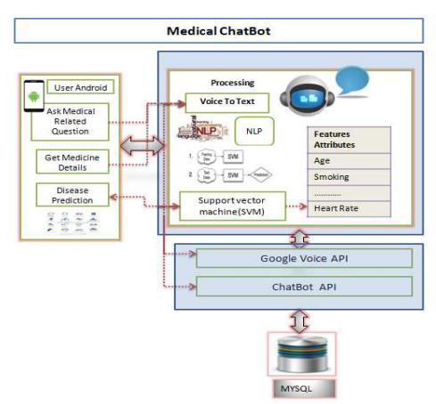
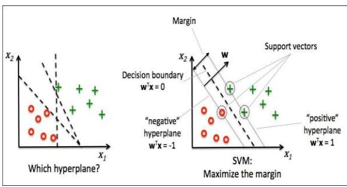
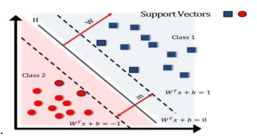
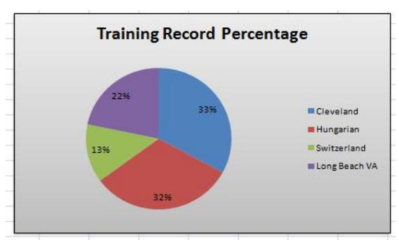
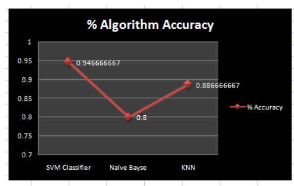

# A Medical ChatBot

Mrs. Rashmi Dharwadkar1, Dr.Mrs. Neeta A. Deshpande2

PG Student, Department of Computer Engineering, D.Y. Patil College, of Engineering, Akurdi, Pune, India1 Professor, Department of Computer Engineering, D.Y. Patil College, of Engineering, Akurdi, Pune, India2

#### Abstract

Normally Users are not aware about all the treatment or symptoms regarding the particular disease. For small problem user have to go personally to the hospital for check-up which is more time consuming. Also handling the telephonic calls for the complaints is quite hectic. Such a problem can be solved by using medical ChatBot by giving proper guidance regarding healthy living.

The medical chat-bots functioning depends on Natural language processing that helps users to submit their problem about the health. The User can ask any personal query related to health care through the chat-Bot without physically available to the hospital. By Using Google API for voice-text and text-voice conversion. Query is sent to ChatBot and gets related answer and display answer on android app. The System's major concern behind developing this web based platform is analysing customer's sentiments.

**Keywords-** Medical Chatbot Natural Language Processing, Porter Stemmer Algorithm, Word Order Similarity Between Sentences

#### I. INTRODUCTION

The main purpose of the scheme is to build the language gap between the user and health providers by giving immediate replies to the Questions asked by the user. Today's people are more likely addicted to internet but they are not concern about their personal health. They avoid to go in hospital for small problem which may become a major disease in future. Establishing question answer forums is becoming a simple way to answer those queries rather than browsing through the list of potentially relevant document from the web. Many of the existing systems have some limitation such as There is no instant response given to the patients they have to wait for experts acknowledgement for a long time. Some of the processes may charge amount to perform live chat or telephony communication with doctors online[7].

This system allows computer to communication between human to computer by using natural language processing (NLP). There are three analyses which understand natural language i.e. identification of main linguistic relations is completed to parse subject into object of the sentences. After that

description of the texts is done. The semantic interpretation uses knowledge of word meaning

Chatbot is an Entity which imitate human discussion in its particular accepted set-up together with a text or vocal language with techniques such as Natural Language Processing (NLP). The aim of this system is to replicate a person's discussion. The development of chatbot application can be done with making a user interface to send input and receive response. It is a system that interact with user by keeping the track of the state of interaction and recollecting the preceding commands to give functionality. The medical chat-bots can be developed by using artificial algorithms that scrutinize user's queries and recognize it and give reply to related query. A big disease can start from small problems such as headache which feels normal but it may beginning of big disease such as brain tumor .most of the disease can be identified by common symptoms so the disease can be predicted if the patient body is analyzed periodically[6]. The system give response by use of an efficient Graphical User Interface such that if actual person is chatting with the user. chatterbot that can be used in various fields like education, healthcare, and route assistance[8]The central part of the chat-bots includes MySQL. It is an interactive system solve users query regarding medicine. so they can get correct guidance for treatment through android app by using Google API.

#### II. LITERATURE REVIEW

The paper gives the information regarding products which is useful for consumers to obtain what they want exactly. Question Answering (QA) systems can be identified as information accessing systems which try to answer to natural language queries by giving answers suitable answers making a use of attribute available in natural language techniques [1]. The system takes a plain text as input and answering all type of questions output by qualified user is the output. The purpose is to provide a generic solution to this problem. this paper helps in recognizing the reality in texts and giving the past content for developing a conversation which is used in middle-school CSCL scenarios[2]. A smart chatbot [3] for customer care by using Software as a Service which analyze message of each application server. It help the user to resolve the issue by providing a human way interactions using LUIS and

ISSN: 2231-2803 http://www.ijcttjournal.org

cognitive services which is implemented on AWS public cloud.Admin feeds input to the machine so that machine can identify the sentences and taking a decision itself as a response to a question. The database used in the project is MySQL. The illustration and execution of SQL in the patternmatching operation is required. The conversation can be done so that it can add some knowledge to the database as it has not been modeled before. If in case the input sentences in the database did not match then it will be remodeled[4]. The evaluation of sentence equivalence is completed with bigram that splits the input sentence in to two parts. The data of chatbot are deposited in the database. The database is appointed as information storage and predictor is used for storing the function and perform pattern matching. This application can be developed by using programming language of Pascal and Java[5].Paper uses artificial intelligence for predict the diseases based on the symptoms and give the list of available treatments. It can facilitate us to figure out the problem and to validate the solution[6].

Author gives chatterbot which is based on AIML (Artificial Intelligent Markup Language) structure [8]for training the model and uses Microsoft voice synthesizer for identification of the word spoken by the user. Natural language processing used for understanding and Microsoft speech recognition is used in speech recognition and speech synthesis for speech to text and text to speech so people get along with it easily.

# **III. PROPOSED SYSTEM**

Some chatbots are compact medical reference books which are useful not only for patients, doctors etc but also for those who want to learn something about health. The user feels that they are incorporated in the process of their health. Patients who feel included, who are interacting through chatbots with the healthcare system, will stay with the system, and that is important for them and the healthcare provider. The old chatbot are client communications systems and their best effort is a question and answer page on a website. Bot can facilitate to get the common health related question and prediction of disease without a human interference.

 This system helps users to submit their complaints and queries regarding the health. Customer satisfactions the major concern for developing this system. . The actual welfare of the chatbot is the facilitate the people by giving proper guidance regarding the good and healthy living. For the reason that many of the people do not have fundamental awareness of physical condition. Some people live for years with debilitating but they do not pay attention to symptoms simply because they think they don't require a doctor. The working of the system is as follows.

# *A. User Login to System*

User registers on Chatbot application. Then ask queries regarding to the health care and medical details.

# *B. Ask some Questions*

You can ask some questions regarding some healthcare. And its related to voice- text and text-voice conversation. Using Google API for inter conversion of text-voice and vice versa.

# *C. Age based Medicine dosage details*

You can ask medical dosage related queries to this app in voice and system gets output for medicine API and speak out and display all data. Get your age from registration data and provide data related to your data like age, area, gender and so on. Give me age

Then predict disease using SVM Algorithm.

# *D. Get Medicine Details on medicine name*

You can ask about medicine related details on the basis of medicine names.

## *E. Disease Prediction*

Depending on the disease symptoms SVM algorithm can predict the disease.

**Fig 1 : System Architecture**

# *F. Online API*

Use Google API for voice-text and textvoice conversion. The Chatbot API sends query to chatbot and get related answer and refer this answer analysis on that and display answer on android app. Get medicine related data like medicine name, medicine expiry details and so on from medicine API.

When user ask question to the scheme, logic of the complaint is recognized by applying NLP. Sense of the words is found using part of speech tagging and WordNet dictionary by using this sentiment analysis.

#### **IV. PROPOSED METHOD**

#### *A. Support Vector Machine Algorithm(SVM):*

SVM is a powerful classifier that is able to distinguish two classes. SVM classifies the test image in to the class with highest distance up to the neighboring point in the training.

 SVM training algorithm built a model that predict whether the test image fall into this class or another.

SVM necessitate a vast training data to decide an decision boundary and computing cost is very high although we are using single pose (frontal) detection.

The SVM is a learning algorithm for classification which attempt to discover the finest distinguishing hyper plane which minimize the error for unseen patterns.

**Figure 2: Distinguishing hyper plane to minimize the error**

The data which cannot be distinguished the input is mapped to high-dimensional attribute space where they can be separated by a hyper plane. This projection is well performed by means of kernels.

If training set of samples and the equivalent resultant values {-1, 1}. So SVM intend to get the best separating hyper plane specified by the equation WT x+b that make use of the distance between the two classes as shown in above figure.

**Figure 3 :Separating Hyper Plane By Equation** *B. NLP(Natural language Processing)*

The enlargement of NLP function is quite tough because computers usually need humans to "speak" with them in certain programming language. Human language is not accurate as it include on a lot of composite variables. NLP permits users to ask a query. The machine understand the important elements from users speech, that may relate to particular features in a data set, and gives an answer. The use of NLP is to recognize the meaning of the text. The stored information contains the text files, like patients' medical records, symptom related to particular disease on the basis of which we can predict the disease also some medicine related information.

Porter stemming algorithm (or 'Porter stemmer') It is a procedure for discarding the ordinary words which is related to the exact form of words with also having flexional endings in English. Following are the steps of this algorithm:-

- o Gets rid of plurals and -ed or -ing suffixes
- o Turns terminal y to i when there is another vowel in the stem
- o Maps double suffixes to single ones: ization, -ational, etc.
- o Deals with suffixes, -full, -ness etc.
- o Takes off -ant, -ence, etc.

Removes a final –e

## *C. Word Order Similarity among Sentences:*

The word order similarity of two sentences is important, because different word order can significantly change the meaning of a sentence.

For example: Dogs can swim, but chicken cannot. We can change the word order so the sentence looks like: Chicken can swim, but dogs cannot. As a result, the meaning of both sentences is completely different. We must therefore form word order vectors for both sentences, namely r1 and r2 . For the first sentence, this is achieved by doing the following for each word w in the joint word set:

- 1. If the first sentence contains w, we fill the entry in r1 with the corresponding index of w in the first sentence.
- 2. If the first sentence does not contain w, we find the word from the first sentence, which is most similar to w. This word is denoted as ~w. If the similarity is greater than the preset threshold, we fill the first sentence's vector entry with the corresponding index of ~w in the first sentence. If the similarity is not greater than the threshold, we fill the vector's entry with 0.

Threshold is important because we are calculating the word similarity of different words and therefore the similarity measures could be very low. Since that mean s the words are not similar, we do not want to introduce such noise into our calculation. If we increase the threshold, we could potentially introduce more noise to our calculations, which is not desirable. We repeat the process for both sentences, so we obtain word order vectors for both sentences. The final value for the word order similarity measure is evaluated using the following formula[9][10].

$$S_r = 1 - \frac{\|r_1 - r_2\|}{\|r_1 + r_2\|}$$

 Word order similarity measure among two sentences is calculated as a normalized differentiation of word order. The measure is sensitive to the distance between two words of the word pair. If the distance increases, the measure decreases.

## **V. EXPERIMENTAL RESULTS**

This work performed analysis on datasets of different sizes and domains to demonstrate that the proposed framework works on data of all sizes and domains. We are using three dataset for different cities of different sizes for giving the information about the heart disease. 60% of each dataset is taken for training the classifier and remaining 40% is taken for testing. Different algorithms require different training and testing times. So accuracy is varying in different algorithm. The used heart disease dataset is shown in the below table.

| Heart Disease Dataset |   |               |                       |                    |            |            |            |            |  |  |  |  |
|-----------------------|---|---------------|-----------------------|--------------------|------------|------------|------------|------------|--|--|--|--|
| Dataset Description   |   |               |                       | Class Distribution |            |            |            |            |  |  |  |  |
| Sr.No                 |   | Dataset       | Training Record Count | Decision 0         | Decision 1 | Decision 2 | Decision 3 | Decision 4 |  |  |  |  |
|                       | 1 | Cleveland     | 303                   | 164                | 55         | 36         | 35         | 13         |  |  |  |  |
|                       | 2 | Hungarian     | 294                   | 188                | 37         | 26         | 28         | 15         |  |  |  |  |
|                       | 3 | Switzerland   | 123                   | 8                  | 48         | 32         | 30         | 5          |  |  |  |  |
|                       | 4 | Long Beach VA | 200                   | 51                 | 56         | 41         | 42         | 10         |  |  |  |  |

**Fig2-HeartDisease DataSet Used**

By training the dataset of different count we get the class wise distribution of the record. Below figure shows the training.record in percentage.

**Fig 4 :Training Record In Percentage**

Comparison with previous work :

K-nearest neighbors classifier and the naive Bayes classifier handles only fast and simple classification tasks whereas SVM can handle better complex classification tasks. SVM classifiers

SVM is faster to train With respect to the best feature space size so that performance is also increase for small or medium sizes.

After comparing the all three methods given in the below table tha accuracy of the SVM is greater than Naïve Bayse and KNN method which is near about 94% greater.

| Algorithm Comparision |   |                |                          |                |            |  |  |  |  |  |
|-----------------------|---|----------------|--------------------------|----------------|------------|--|--|--|--|--|
| <b>0</b>              |   |                |                          |                |            |  |  |  |  |  |
| Sr.No                 |   | Algorithms     | No Of Disease Conditions | Accurate Answe | % Accuracy |  |  |  |  |  |
|                       | 1 | SVM Classifier | 150                      | 142            | 0.9466667  |  |  |  |  |  |
|                       | 2 | Naïve Bayse    | 150                      | 120            | 0.8        |  |  |  |  |  |
|                       | 3 | KNN            | 150                      | 133            | 0.8866667  |  |  |  |  |  |
|                       |   |                |                          |                |            |  |  |  |  |  |

**Fig 4: plot of Algorithm Accuracy after comparison of different method**

# **VII. CONCLUSION**

By reviewing the literature we come to know that this system giving the accurate result. As we are using large dataset which will ensures the better performance compared as earlier.

Thus we build up a system which is useful for medical institute or hospitals to help the users to freely ask medical dosage related queries by voice. System gets output for medicine API and speak out and display all medicine names. We are using NLP because we want to a computer to communicate with users in their terms. So by using SVM algorithm and disease symptoms system can predict disease. User can get related answer displayed r on android app. and refer this answer for analysis.

# **FUTURE SCOPE**

By taking the advantage of the extensibility of the system in future it will be used as voice and face recognition to mimic a counselor, also interacting with the patient at deeper levels.

## **REFERENCES**

- [1] Agnese Augello, Giovanni Pilato, Alberto Machi' ICAR Istituto di Calcolo e Reti ad Alte Prestazioni CNR - Consiglio Nazionale delle Ricerche Viale delle Scienze , 978-0-7695- 4859-3/12 \$26.00 © 2012 IEEE . "An Approach to Enhance Chatbot Semantic Power and Maintainability: Experiences within the FRASI Project".
- [2] Emanuela Haller, Traian Rebedea Faculty of Automatic Control and Computers university Politehnica of Bucharest, 978-0-7695-4980-4/13 \$26.00 © 2013 IEEE. "Designing a Chat-bot that Simulates a Historical Figure".
- [3] "Real World Smart Chatbot for Customer Care using a Software as a Service (SaaS) Architecture"Godson Michael D'silva1, \*, Sanket Thakare2, Sharddha More1, and Jeril Kuriakose1,International conference on I-SMAC (IoT in Social, Mobile, Analytics and Cloud)
- [4] Bayu Setiaji, Ferry Wahyu Wibowo , Department of Informatics Engineering STMIK AMIKOM Yogyakarta, Yogyakarta, Indonesia, 2166-0670/16 \$31.00 © 2016 IEEE "Chatbot Using A Knowledge in Database-Human-to-Machine Conversation Modeling".
- [5] Chatbot Using A Knowledge in Database,"Bayu Setiaji,Ferry Wahyu Wibowo",2016 7th International Conference on Intelligent Systems, Modelling and Simulation.2016 IEEEE.
- [6] "Novel Approach for Medical Assistance Using Trained Chatbot",Divya Madhu, Neeraj Jain C,International Conference on Inventive Communication and Computational Technologies.

- [7] V.Manoj Kumar"Sanative Chatbot For Health Seekers",JECS Volume 05 Issue 3 March 2016 Page No.16022-16025.
- [8] Imran Ahmed and Shikha Singh"AIML Based Voice Enabled Artificial Intelligent Chatterbot",International Journal of u-and e-Service, Science and Technology Vol.8, No.2 (2015).
- [9] Ercan Canhasi,"Measuring the sentence level similarity "35 ISCIM 2013, pp. 35-42.
- [10] Yuhua Li, Zuhair Bandar, David McLean and James O'Shea "A Method for Measuring Sentence Similarity and its Application to Conversational Agents "Intelligent Systems Group.