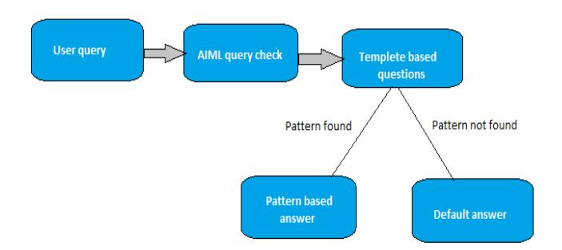
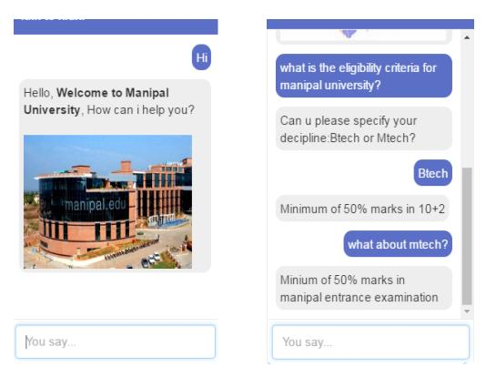
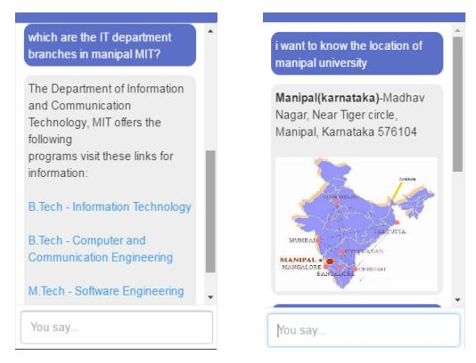

# Chatbot for University Related FAQs

Bhavika R. Ranoliya\*, Nidhi Raghuwanshi\* and Sanjay Singh\*†

\* Department of Information and Communication Technology

Manipal Institute of Technology, Manipal University, Karnataka-576104, India

†Centre for Artificial and Machine Intelligence

Manipal University, Karnataka-576104, India

bhavika.patel40@gmail.com, nidhiraghuwanshi710@gmail.com, sanjay.singh@manipal.edu

Abstract—Chatbots are programs that mimic human conversation using Artificial Intelligence (AI). It is designed to be the ultimate virtual assistant, entertainment purpose, helping one to complete tasks ranging from answering questions, getting driving directions, turning up the thermostat in smart home, to playing one's favorite tunes etc. Chatbot has become more popular in business groups right now as they can reduce customer service cost and handles multiple users at a time. But yet to accomplish many tasks there is need to make chatbots as efficient as possible. To address this problem, in this paper we provide the design of a chatbot, which provides an efficient and accurate answer for any query based on the dataset of FAQs using Artificial Intelligence Markup Language (AIML) and Latent Semantic Analysis (LSA). Template based and general questions like welcome/ greetings and general questions will be responded using AIML and other service based questions uses LSA to provide responses at any time that will serve user satisfaction. This chatbot can be used by any University to answer FAQs to curious students in an interactive fashion.

Keywords—Artificial Intelligence Markup Language(AIML), Latent Semantic Analysis(LSA), Pattern Matching, Chatbot, Human Computer Interaction(HCI)

#### I. INTRODUCTION

Todays era is having many web based services like E-business, Entertainment, Virtual assistance and many more. There is drastic increase in the world of web service, where every thing is now getting associated with web. It is very user friendly approach to avail everything to doorstep. There are different types of customer service available like live chat support service, phone(telephone) services. But for all such support services provided by human to human takes time to answer customers query. As the number of clients increases the waiting time increases as well, which results in poor client satisfaction.

One of the important goals in the field of Human Computer Interaction (HCI) is the outline of normal and instinctive connection modalities. Specifically, numerous endeavors have been committed to the improvement of frameworks to communicate with the client in a characteristic language [1]. Computer based chatbots are getting to be distinctly famous as an intuitive and successful open framework between human and machines. Chatbot is a manufactured substance that is intended to reproduce a clever discussion with human accomplices through their regular language. Currently, chatbots are utilized by a great many web clients to intercede access to information or learning bases and furthermore to do non specific discussions [2].

AIML and LSA is used for creating chatbots. AIML is Artificial Intelligence Markup Language (AIML) and Latent Semantic Analysis (LSA) are used for developing chatbots, which are used to define general queries like how do you do?, how can I help you etc. This pattern can also be used to give random responses for same query. LSA [3] is a Latent Semantic Analysis, which is utilized to discover likenesses between words as vector representation. So that the unanswered queries by AIML will be viewed as a reply by LSA. Most chatbots basically search for keywords, phrases, and examples that have been customized into their databases, yet some utilize more propelled strategies. So far no chatbot has possessed the capacity to totally trick people into trusting it as one of them through its information of regular dialect [4]. In this paper the need for chatbot in education domain is highlighted and designed to provide visitor satisfaction.

Rest of the paper is organized as follows. Section II reviews the related work, which is not exhaustive but only the most relevant ones. Section III briefs about existing applications of chatbots particularly ELIZA and ALICE. Section IV discusses about AIML. Section V presents the proposed chatbot design. Section VI gives some screen shots of the chatbot response and finally section VII concludes the paper.

#### II. RELATED WORK

Weizenbaum J shows psychological issues related to the ELIZA [1]. Thomas T [3] provided the way by which the chatbot is planned in a manner that for single template, it gives irregular responses. LSA based inquiries are giving right reactions for random responses.

Rashmi S and Kannan Balakrishnan [5] has provided the execution of a curious chatbot, which finds the missing information in inquiry and tests the queries to clients to gather information that are required to answer the question. Identification of missing data and querying same to provide accurate response. D. Aimless and S. Umatani [6] illustrated the usage of AIML tags that will describes the functionality and features of each tags associated to build AIML based chatbot.

#### III. EXISTING APPLICATIONS

"Chatbots are program that interact with humans using natural language" [5]. Chatbots are used in many organizational domains where it can replace humans. Such systems are based on the ways ELIZA or ALICE communicates.

*1) ELIZA:* ELIZA [5] is the primary chatbot created by Joseph Weizenbaum utilizing a keyword coordinating strategy. The thought was to persuade the client info and look for certain keywords, if a catchphrase was discovered then the appropriate response was recovered. In the event that a catchphrase is not present then ELIZA would proceed, as per indicated principles, to get more data from the client to keep the discussion going. Consider the accompanying case to see how this would function.

User: How would I be able to get good result?

At that point the chatbot would recognize the catchphrase result and would discover an association amongst result and subject and it would react with a question.

ELIZA: Please provide more information about your subject.

The chatbot does not comprehend what it is stating. It just creates about as indicated by guidelines and for this situation there was a control connecting family and mother. At that point it needed to create an answer that would urge the client to present another question with the trust of finding a keyword. But more often than not ELIZA gives standard answers if a keyword is not found.

There are some interesting examples, even we can try some different examples. Code 1 gives a decent case of talking with ELIZA.

Code 1: A specimen discussion with ELIZA [7]

```
Human : You a r e l i k e my f a t h e r i n some ways .
ELIZA : What r e s e m bl a n c e do you s e e
Human : You a r e n ot v e r y a g g r e s s i v e .
ELIZA : What makes you t o t h i n k I am n ot a g g r e s s i v e
Human : You don ' t a r g u e wit h me .
ELIZA : Why do you t h i n k I don ' t a r g u e wit h you
Human : You a r e a f r a i d o f me .
ELIZA : Does i t p l e a s e you t o b e l i e v e I am a f r a i d
```

*2) ALICE:* ALICE is developed by Richard Wallace in 1995 [8]. It utilizes design coordinating and stores the data in Artificial Intelligence Mark-up Language records. An AIML record is like a XML document that is created to store design information for chatbots. Code 2 gives a case of a discussion between a human and ALICE.

Code 2: An example discussion with ALICE [9]

```
U se r : H ell o ALICE
A l i c e : Hi t h e r e !
U se r : How ol d a r e you ?
A l i c e : I am e i g h t e e n i n c om p ut e r y e a r s
U se r : Who i s y o u r f a t h e r ?
A l i c e : I was programmed by Dr . Ri c h a r d S . W all a c e
U se r : s o you a r e a s o f t w a r e p r o g ram ?
A l i c e : I n t e r e s t i n g d e d u c t i o n . Thanks and you a r e a
d e l i g h t f u l p e r s o n t o o . Am I a s o f t w a r e p r o g ram ?
U se r : w o n d e r f ul ! So what ' s y o u r f a v o r i t e f o o d ALICE?
A l i c e : Yeah t h a t ' s r i g h t ! I r e q u i r e o nl y e l e c t r i c i t y
```

## IV. ARTIFICIAL INTELLIGENCE MARKUP LANGUAGE

Extensible Markup Language (XML) is the base for derivation of Artificial Intelligence Markup Language (AIML). It has class of data object called an AIML object that describes the behavior of computer programs. It consist of units or tag called topics and categories. In AIML, categories are basic unit of knowledge. Each category consists of pattern which contains input and template which contain answer of chatbot. Besides, there are some optional context called "that" and "topic". Tag, < that > contain chatbot's last utterance and < topic > contain a collection of categories together. AIML consists of words, underscore, symbols and wild card symbol like and ∗.

There are three types of AIML classes:

- 1) Atomic categories
- 2) Default categories
- 3) Recursive categories

Atomic category : It is a sort of AIML classification where there is a exact match.

```
< category >
< pattern >How are you< /pattern >
< template >I am fine!< /template >
< /category >
```

In the above illustration if the client submits *How are you* then the chatbot will answer with *I am fine!*.

Default category : It is a kind of AIML class where the utilization of a wild card symbols, for example, \* is utilized to coordinate any info.

```
< category >
< pattern >Who is * < /pattern >
< template > He is my brother < /template >
< /category >
```

In the event that ALICE does not discover an answer utilizing the main classification it continues to the next. For such situation if a client submits *Who is Joy* then ALICE will search until the wild symbol and if there is a match it will accompany the appropriate response.

Recursive category : It is a type of an AIML classification where exceptional labels are utilized to allude to a recursion to persuade the user to be more particular.

```
< category >
< pattern > Can you tell who the * is < /pattern >
< template > He is my brother
< srai > Who is * < /srai >
< /template >
< /category >
```

For such situation the wild symbol \* is utilized to decrease the information presented by user.

## *A. AIML Tags*

Different type of AIML tags are:

• < aiml > tag :

AIML files start with tag < aiml > and ends with < /aiml >. It also contains encoding and version attributes that describes the basic usage of AIML. Version attribute defines AIML version and encoding attribute describes the character set that is used for document [6]. Code 3 gives an example of < aiml > tag.

Code 3: Example of < aiml > tag

```
<aiml v e r s i o n =" 1 . 0 . 1 " e n c o di n g ="UTF−8" ?>
<c a t e g o r y>
            <p a t t e r n> HELLO BOT </ p a t t e r n>
            <t e m p l a t e>
                         H ell o my new f r i e n d !
            </ t e m p l a t e>
</ c a t e g o r y>
</ aiml>
```

## • < category > tag :

Multiple < category > tag are used under < aiml > tag. Each < category > tag describes different knowledge base which is bounded within it. Modeling of this tag is done by using < category > and < /category > tags [6]. This tag should also contain < pattern > and < template > tags as shown in Code 3.

### • < pattern > tag :

The < pattern > tag states the possible user entered query. The < pattern > tag appears as a single tag, and it should be the first most element within < category > tag. Sentences written in this tag should be separated by unit space. Words within this statement can be replaced by wild card symbol \*. Example given in Code 3 shows that the user has entered query as HELLO BOT which is considered as query pattern [6].

### • < template > tag :

The < template > stores answer to the user's query. This tag have the scope within < category > and it should be written just after < pattern >. Almost all of the chatbot data is bounded within this tag. Also conditional answers and call to other answers are written within this tag. Code 3 shows the use of < template > tag where answer (Hello my new friend!) is written for the selected pattern.

## • < srai > tag :

The < srai > tag shows an important characteristic of AIML. By using < srai > we can target a multiple < pattern > for a single < template > [6]. So AIML interpreter will efficiently answer for different user input having similar meaning.

One can make use of < srai > tag in multiple ways.

◦ Symbol reduction with the < srai > tag

Code 4: < srai > with symbol reduction

```
<c a t e g o r y>
            <p a t t e r n> WHO IS ALAN TURING? </ p a t t e r n>
            <t e m p l a t e>
                         Alan T u ri n g was a B r i t i s h m at h e m ati ci a n .
            </ t e m p l a t e>
</ c a t e g o r y>
<c a t e g o r y>
            <p a t t e r n> WHO IS ALBERT SABIN? </ p a t t e r n>
            <t e m p l a t e>
                         A l b e r t S a bi n was a r e s e a r c h e r .
            </ t e m p l a t e>
</ c a t e g o r y>
<c a t e g o r y>
            <p a t t e r n> DO YOU KNOW ∗ IS ? </ p a t t e r n>
            <t e m p l a t e>
                        <s r a i> WHO IS <s t a r /></ s r a i>
            </ t e m p l a t e>
</ c a t e g o r y>
```

◦ Divide and conquer with the < srai > tag

Code 5: < srai > with divide and conquer

```
<c a t e g o r y>
             <p a t t e r n> BYE </ p a t t e r n>
             <t e m p l a t e>
                          Goodbye f r i e n d !
             </ t e m p l a t e>
</ c a t e g o r y>
<c a t e g o r y>
             <p a t t e r n> BYE ∗ </ p a t t e r n>
             <t e m p l a t e>
                          <s r a i> BYE </ s r a i>
             </ t e m p l a t e>
</ c a t e g o r y>
```

◦ Synonyms resolution with the < srai > tag

Code 6: < srai > with synonyms reduction

```
<c a t e g o r y>
            <p a t t e r n> INDUSTRY </ p a t t e r n>
            <t e m p l a t e>
             I t i s a d e v el o pm e nt c e n t e r .
            </ t e m p l a t e>
</ c a t e g o r y>
<c a t e g o r y>
            <p a t t e r n> FACTORY </ p a t t e r n>
            <t e m p l a t e>
                         <s r a i> INDUSTRY </ s r a i>
            </ t e m p l a t e>
</ c a t e g o r y>
```

◦ Keyword detection with < srai > tag

Code 7: < srai > Keyword Detection

```
<c a t e g o r y>
            <p a t t e r n> FAMILY </ p a t t e r n>
            <t e m p l a t e>
                         Famil y i s i m p o r t a n t .
            </ t e m p l a t e>
</ c a t e g o r y>
<c a t e g o r y>
            <p a t t e r n> FAMILY </ p a t t e r n>
            <t e m p l a t e>
                         <s r a i> FAMILY </ s r a i>
            </ t e m p l a t e>
</ c a t e g o r y>
<c a t e g o r y>
            <p a t t e r n> FAMILY ∗ </ p a t t e r n>
            <t e m p l a t e>
                         <s r a i> FAMILY </ s r a i>
            </ t e m p l a t e>
</ c a t e g o r y>
<c a t e g o r y>
            <p a t t e r n> FAMILY ∗ </ p a t t e r n>
            <t e m p l a t e>
                         <s r a i> FAMILY </ s r a i>
            </ t e m p l a t e>
</ c a t e g o r y>
```

• < random > with < li > tag :

This tags is used for generating random responses that will make a more of human like interaction. Every time user will receive the different answer which is fed within the < li > tag. Code 8 illustrates the usage of this tags.

## Code 8: Example of < random > and < li > tags

```
<c a t e g o r y>
           <p a t t e r n> HI </ p a t t e r n>
           <t e m p l a t e>
                       <random>
                       < l i> Nice t o meet you </ l i>
                       < l i> H ell o , How a r e you ? </ l i>
                       < l i> H ell o ! </ l i>
                       </ random>
           </ t e m p l a t e>
</ c a t e g o r y>
```

### • < set > and < get > AIML tags:

These AIML tags allows to work with variables such as name, location, gender etc. which are already specified in the dilemma to store the data regarding chatbot [6]. Tag, < set > is used to define variable and < get > tag returns the answer stored by < set > tag. Both the tag has to be defined within the scope of < template >.

Code 9: < set > tag

```
<c a t e g o r y>
            <p a t t e r n> MY NAME IS ∗ </ p a t t e r n>
            <t e m p l a t e>
                         H ell o <s e t name=" nameUser ">
                        <s t a r /></ s e t>
            </ t e m p l a t e>
</ c a t e g o r y>
```

# Code 10: < get > tag

```
<c a t e g o r y>
            <p a t t e r n> GOOD NIGHT </ p a t t e r n>
            <t e m p l a t e>
            Good n i g h t <g e t name=" nameUser " />
            </ t e m p l a t e>
</ c a t e g o r y>
```

## • < that > tag :

The < that > tag suggest to the system to identify the last usage of the sentence given by chatbot. It is vital to investigate the most current occurrence of chatbot is critical when the chatbot has raised a query, the users reaction should be specified in connection to this question. Scope of this tag is bounded within < category > tag [10].

Code 11: Example of < that > tag

```
<c a t e g o r y>
<p a t t e r n> MAKE SOME QUESTIONS </ p a t t e r n>
            <t e m p l a t e>
                         Do you l i k e m o vie s ?
            </ t e m p l a t e>
</ c a t e g o r y>
<c a t e g o r y>
            <p a t t e r n> YES </ p a t t e r n>
            <t h a t>Do you l i k e m o vie s ?</ t h a t>
            <t e m p l a t e>
                         Nice , I l i k e m o vie s t o o .
            </ t e m p l a t e>
</ c a t e g o r y>
            <p a t t e r n> NO </ p a t t e r n>
            <t h a t> Do you l i k e m o vie s ? </ t h a t>
            <t e m p l a t e>
            OK. But I l i k e m o vie s .
            </ t e m p l a t e>
</ c a t e g o r y>
```

## • < topic > tag :

The < topic > tag is utilized to sort out subjects or points that the chatbot will have the capacity to talk. To accomplish this, the classifications that arrangement with a similar subject are assembled together, to enhance the scan for sensible chatbot's reactions, to be sent to client [10]. Code 12 shows an example using this tag.

Code 12: Example of < topic > tag

```
<c a t e g o r y>
<p a t t e r n>LET TALK ABOUT FLOWERS.</ p a t t e r n>
            <t e m p l a t e>
             Yes <s e t naem=" t o p i c ">f l o w e r s</ s e t>
            </ t e m p l a t e>
</ c a t e g o r y>
<t o p i c name=" f l o w e r s ">
            <c a t e g o r y>
                         <p a t t e r n> ∗ </ p a t t e r n>
                         <t e m p l a t e>
                          f l o w e r s ha ve a n i c e s m e l l .
                         </ t e m p l a t e>
            </ c a t e g o r y>
            <c a t e g o r y>
            <p a t t e r n> I LIKE IT SO MUCH! <p a t t e r n>
                         <t e m p l a t e>
                                      I l i k e f l o w e r s t o o .
                         </ t e m p l a t e>
            </ c a t e g o r y>
</ t o p i c>
```

## • < think > tag :

The substance of < think > is prepared by the chatbot, however not shown to user. The < think > tag is utilized for information handling, restrictive explanations and tests that ought not be noticeable to user [10].

Code 13: Example of < think > tag

```
<c a t e g o r y>
            <p a t t e r n> MY NAME IS ∗ </ p a t t e r n>
            <t e m p l a t e>
            <t h i n k><s e t name=" nameUser ">∗</ s e t>
            </ t h i n k>
            </ t e m p l a t e>
</ c a t e g o r y>
```

## • < condition > tag :

The < condition > tag is utilized at whatever point there is a rundown of conceivable responses that is to be shown to the user, the decision of the absolute fitting reaction depends on the examination of a specific variable which was refreshed amid the discussion among the user and the chatbot. The < condition > tag rule is proportional to the "case" command, found in many programming dilemma. This tag considers variable name as parameters and the value to be looked at [6].

#### Code 14: Example of < condition > tag

```
<c a t e g o r y>
            <p a t t e r n>HOW ARE YOU?</ p a t t e r n>
            <t e m p l a t e>
            <c o n d i t i o n name=" s t a t e " v al u e=" happy ">
                              I t i s n i c e b ei n g happy .
                         </ c o n d i t i o n>
                              Bei n g s a d i s n ot n i c e .
            </ t e m p l a t e>
</ c a t e g o r y>
```

• < bot > tag :

Code 15: Example of < bot > tag

```
<c a t e g o r y>
            <p a t t e r n>b ot p r o p e r t i e s</ p a t t e r n>
            <t e m p l a t e>
                         <b ot name=" a ge " />
                         <b ot name=" g e n d e r " />
                         <b ot name=" l o c a t i o n " />
                         <b ot name=" n a t i o n a l i t y " />
                         <b ot name=" b i r t h d a y " />
                         <b ot name=" s i g n " />
                         <b ot name=" b o t m a s t e r " />
            </ t e m p l a t e>
</ c a t e g o r y>
```

The < bot > tag is used to know about the chatbot properties. This properties can be viewed by user during conversation [6].

# V. PROPOSED SYSTEM

In this work we have developed a interactive chatbot for University related Frequently Asked Questions (FAQs), and the work flow of proposed framework is shown in Fig.1. User discussion as a rule begins with welcome or general questions. User inquiries are first taken care by AIML check piece to check whether entered inquiry is AIML script or not. AIML is characterized with general inquiries and welcome which is replied by utilizing AIML formats. This operation is divided into three parts:

- User post the query on chatbot
- Processing is done on the users query to match the predefined format by the developer
- Pattern matching is performed between user entered query and knowledge (pattern).

Finally pattern based answer is presented to the user to answer their query. This paper presents the chatbot for educational sector, where user (a student or parents) can ask query regarding college admission, about college information and other things related to academics. As discussed earlier, user can post their query on chatbot and response is generated based on pattern matching techniques presented in this paper.

## VI. RESULTS

Chatbot is implemented to meet the academic needs of the visitors. The chatbot is based on AIML language for Manipal University. This will help the student to fetch information like ranking of university, availability of services, university environment, updates regarding activities happening inside campus and many more and other academic information. A snapshot of the proposed chatbot is shown in Fig.2 and 3 respectively.



Fig. 1: System Workflow



Fig. 2: Chatbot response snapshot 1



Fig. 3: Chatbot response snapshot 2

## VII. CONCLUSION

Artificial Intelligence conversational agents are becoming popular for web services and systems like scientific, entertainment and commercial systems, and academia. But more effective human-computer interaction will takes place by querying missing data by the user to provide satisfactory answer. In this paper we have proposed and implemented an interactive chatbot for University environment using AIML.

As a future work we can make a chatbot which is blend of AIML and LSA. This will enable a client to interact with chatbot in a more natural fashion. We can enhance the discussion by including and changing patterns and templates for general client queries using AIML and right response are given more often than not utilizing LSA.

## REFERENCES

- [1] J. Weizenbaum, "Elizaa computer program for the study of natural language communication between man and machine," *Communications of the ACM*, vol. 9, no. 1, pp. 36–45, 1966.
- [2] A. M. Neves, F. A. Barros, and C. Hodges, "Iaiml: A mechanism to treat intentionality in aiml chatterbots," in *Tools with Artificial Intelligence, 2006. ICTAI'06. 18th IEEE International Conference on*. IEEE, 2006, pp. 225–231.
- [3] N. Thomas, "An e-business chatbot using aiml and lsa," in *Advances in Computing, Communications and Informatics (ICACCI), 2016 International Conference on*. IEEE, 2016, pp. 2740–2742.
- [4] S. Reshmi and K. Balakrishnan, "Implementation of an inquisitive

- chatbot for database supported knowledge bases," *Sadhan ¯ a¯*, vol. 41, no. 10, pp. 1173–1178, 2016.
- [5] B. A. Shawar and E. Atwell, "Chatbots: are they really useful?" in *LDV Forum*, vol. 22, no. 1, 2007, pp. 29–49.
- [6] M. d. G. B. Marietto, R. V. de Aguiar, G. d. O. Barbosa, W. T. Botelho, E. Pimentel, R. d. S. Franc¸a, and V. L. da Silva, "Artificial intelligence markup language: A brief tutorial," *arXiv preprint arXiv:1307.3091*, 2013.
- [7] D. Jurafsky and J. H. Matin, *Speech and Language Processing: An Introduction to Natural Language Processing, Computational Linguistics, and Speech Recognition*. New Delhi: Pearson, 2011, ch. Introduction, pp. 27–35.
- [8] R. S. Wallace, "Alice: Artificial intelligence foundation inc," *Received from: http://www. alicebot. org*, 2008.
- [9] B. A. Shawar and E. Atwell, "Chatbots: Are they really useful?" *LDV Forum*, vol. 22, pp. 29–49, 2007.
- [10] D. Aimless and S. Umatani, "A tutorial for adding knowledge to your robot," *Retrieved from*, 2004.