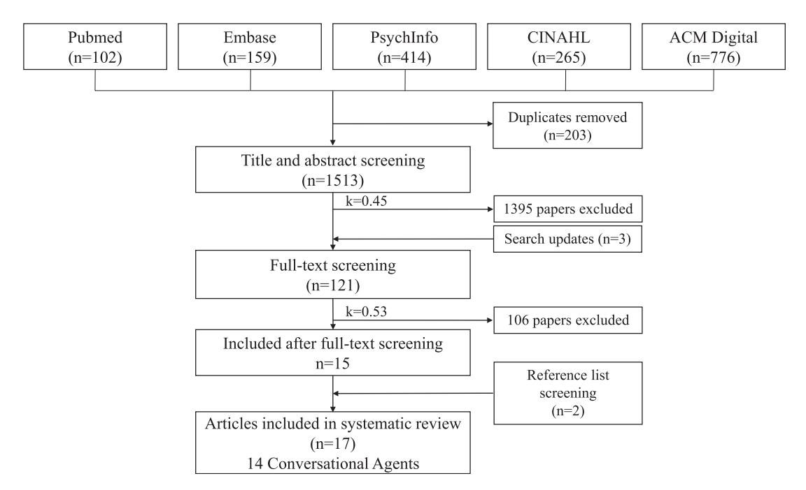
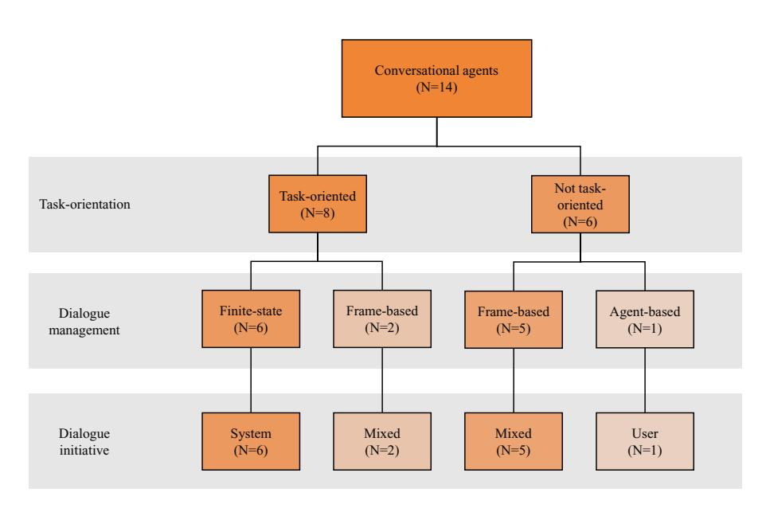

Journal of the American Medical Informatics Association, 25(9), 2018, 1248–1258

doi: 10.1093/jamia/ocy072

Advance Access Publication Date: 11 July 2018

Review

# Review

# Conversational agents in healthcare: a systematic review

Liliana Laranjo,\* Adam G Dunn,\* Huong Ly Tong, Ahmet Baki Kocaballi, Jessica Chen, Rabia Bashir, Didi Surian, Blanca Gallego, Farah Magrabi, Annie YS Lau, and Enrico Coiera

Centre for Health Informatics, Australian Institute of Health Innovation, Macquarie University, Sydney, Australia

Correspondence to Liliana Laranjo, Centre for Health Informatics, Australian Institute of Health Innovation, Macquarie University, Level 6, 75 Talavera Road, Sydney, 2113 NSW, Australia; liliana.laranjo@mq.edu.au \*Liliana Laranjo and Adam G Dunn contributed equally.

Received 20 February 2018; Revised 15 May 2018; Editorial Decision 16 May 2018; Accepted 21 May 2018

#### ABSTRACT

Objective: Our objective was to review the characteristics, current applications, and evaluation measures of conversational agents with unconstrained natural language input capabilities used for health-related purposes. Methods: We searched PubMed, Embase, CINAHL, PsycInfo, and ACM Digital using a predefined search strategy. Studies were included if they focused on consumers or healthcare professionals; involved a conversational agent using any unconstrained natural language input; and reported evaluation measures resulting from user interaction with the system. Studies were screened by independent reviewers and Cohen's kappa measured inter-coder agreement. Results: The database search retrieved 1513 citations; 17 articles (14 different conversational agents) met the inclusion criteria. Dialogue management strategies were mostly finite-state and frame-based (6 and 7 conversational agents, respectively); agent-based strategies were present in one type of system. Two studies were randomized controlled trials (RCTs), 1 was cross-sectional, and the remaining were quasi-experimental. Half of the conversational agents supported consumers with health tasks such as self-care. The only RCT evaluating the efficacy of a conversational agent found a significant effect in reducing depression symptoms (effect size d ¼ 0.44, p ¼ .04). Patient safety was rarely evaluated in the included studies.

Conclusions: The use of conversational agents with unconstrained natural language input capabilities for health-related purposes is an emerging field of research, where the few published studies were mainly quasiexperimental, and rarely evaluated efficacy or safety. Future studies would benefit from more robust experimental designs and standardized reporting.

Protocol Registration: The protocol for this systematic review is registered at PROSPERO with the number CRD42017065917.

Key words: artificial intelligence [Mesh], medical informatics [Mesh], conversational agent, dialogue system

#### INTRODUCTION

Advances in voice recognition, natural language processing, and artificial intelligence have led to the increasing availability and use of conversational agents—systems that mimic human conversation using text or spoken language. Familiar examples of conversational agents include voice-activated systems like Apple Siri, Google Now, Microsoft Cortana, or Amazon Alexa.[1](#page-9-0)

Some of the earliest examples of conversational agents were chatbots built with the aim of being indistinguishable from a human, in order to pass the Turing test. These systems were tested in experiments where human users would engage with them in conversation (typing in a computer) and decide whether they were talking to a human or a machine[.1](#page-9-0) The first well-established chatbot of this kind—ELIZA—was programmed in 1966 to simulate a text-based conversation with a psychotherapist[.2](#page-9-0)

VC The Author(s) 2018. Published by Oxford University Press on behalf of the American Medical Informatics Association.

This is an Open Access article distributed under the terms of the Creative Commons Attribution Non-Commercial License (http://creativecommons.org/licenses/by-nc/4.0/), which permits non-commercial re-use, distribution, and reproduction in any medium, provided the original work is properly cited. For commercial re-use, please contact journals.permissions@oup.com 1248

Over the last two decades, a solid body of evidence has shown the potential benefits of using embodied conversational agents for health-related purposes. Several randomized controlled trials of interventions involving embodied conversational agents have shown significant improvements in physical activity, fruit and vegetable consumption, and accessibility to online health information, among other outcomes.[3–6](#page-9-0) However, the majority of these agents only allowed for constrained user input (eg multiple-choice of utterance options), not having the capability to understand natural language input.

A recent renewed interest in artificial intelligence has seen an increase in the popularity of conversational agents, particularly those with the capability to use any unconstrained natural language input[.7](#page-9-0) Advances in machine learning, particularly in neural networks, has allowed for more complex dialogue management methods and more conversational flexibility.[8,9](#page-9-0) Given the development of increasingly powerful and connected devices, and growing access to contextual information (such as from sensors), smartphone conversational agents are now widely used by consumers for daily tasks like retrieving information and managing calendars.

In light of their expanding capabilities, conversational agents have the potential to play an increasingly important role in health and medical care, assisting clinicians during the consultation, supporting consumers with behavior change challenges, or assisting patients and elderly individuals in their living environments.[10,11](#page-9-0) These opportunities also come with potential safety issues, which can lead to patient harm. To our knowledge, no systematic review of the use of this technology in healthcare has been undertaken. In order to address this gap, our aim was to systematically identify and review studies of conversational agents that use any unconstrained natural language input for health-related purposes, focusing on their characteristics, applications, and evaluation methods.

# METHODS

We focused our study on conversational agents that use any unconstrained natural language input, given their growing availability and use. Based on existing literature, there is a lack of consensus regarding the definitions of conversational agents, dialogue systems, embodied conversational agents, smart conversational interfaces, or chatbots[.1,8,9,12,13](#page-9-0) Examples of conversational agents include (but are not limited to): chatbots, which have the ability to engage in "small talk" and casual conversation; embodied conversational agents, which involve a computer-generated character (eg avatar, virtual agent) simulating face-to-face conversation with verbal and nonverbal behavior; and smart conversational interfaces such as Apple Siri, Google Now, Microsoft Cortana, or Amazon Alexa[.1,8,9](#page-9-0) For the purposes of this review, we considered the subset of conversational agents that use any unconstrained natural language input. Excluded systems were constrained input conversational agents using only non-natural language communication, which have been the focus of past reviews (eg embodied conversational agents where input occurs via multiple-choice of utterance options).[12](#page-9-0)

#### Search strategy

A systematic search of the literature was performed in April 2017, and updated in February 2018, using PubMed, Embase, CINAHL, PsycInfo, and ACM Digital Library, not restricted by publication year or language. Search terms included "conversational agents," "dialogue systems," "relational agents" and "chatbots" (complete search strategy available in [Supplementary Material](https://academic.oup.com/jamia/article-lookup/doi/10.1093/jamia/ocy072#supplementary-data) S1). We also searched the reference lists of relevant articles. Grey literature identified in those databases (including dissertations, theses, and conference proceedings), were also included for screening.

## Study selection criteria

We included primary research studies that focused on consumers, caregivers, or healthcare professionals; involved a conversational agent that used any unconstrained natural language input; and tested the system with human users. We excluded studies of systems where user input occurred by clicking or tapping an answer amongst a set of predefined choices, or by using the telephone keypad (eg interactive voice response systems with dual-tone multi-frequency); the output was not generated in response to what it received from the human user (eg predefined and pre-programmed messages); question-answer systems; and systems that used asynchronous communication technology such as email.

To be included, studies must also have reported evaluations based on human users interacting with the full system. Studies evaluating only individual components of the conversational agent—automatic speech recognition, natural language understanding, dialogue management, response generation, text-to-speech synthesis—were excluded. We also excluded studies using "Wizard of Oz" methods, where the dialog is generated by a human operator rather than the conversational agent.

#### Screening, data extraction, and synthesis

Screening procedures were piloted before the beginning of the screening process. Initial screening of articles was based on the information contained in their titles and abstracts and was conducted by 3 teams of 2 independent investigators. Full-text screening was conducted by the same investigator teams. Articles from search updates (April 2017 to February 2018) had their titles and abstracts screened by 1 investigator, and full-text screening by 2 independent investigators. Cohen's kappa was used to measure inter-coder agreement between individuals. Any remaining disagreements about inclusion or exclusion of an article were resolved by a third investigator.

The following data were extracted for each study: first author, year of publication, type of study, methods, type, and characteristics of the technology (Box 1), study duration (if applicable), participants' and setting characteristics, evaluation measures (Box 2), engagement measures (if applicable), and funding source.

Evaluation measures present in the included studies were extracted based on 3 types of evaluation: technical, user experience, and health research. Technical evaluation of a conversational agent included the objective assessment of the technical properties of the system as a whole and, where available, the evaluation of its individual components.[8](#page-9-0),[14](#page-9-0) User experience evaluation was considered a subjective assessment, where a group of users tested the system to judge its properties or components based on their personal opinions[,14](#page-9-0) via qualitative (eg focus groups) or quantitative methods (eg surveys).[15](#page-9-0) The evaluation of a conversational system from a health research perspective was considered to involve any health-related results present in the included studies, including process and outcome measures as defined by Donabedian[;16](#page-9-0) for example, effectiveness in symptom reduction, diagnostic accuracy, or referrals.

Two investigators reviewed all details extracted from the set of included studies for consistency; disagreements were resolved by a third investigator. Where applicable, trial quality was assessed using Cochrane's risk of bias tool.[17](#page-9-0) Due to the heterogeneity of managementa

Box 1. Characterization of conversational agents

Platform supporting the conversational agent: software application delivered via mobile Type of technology

device (eg smartphone, tablet), laptop or desktop computer, or via web browser;

SMS; telephone; or multimodal platform.

Dialogue Finite-state The user is taken through a dialogue consisting of a sequence of pre-determined steps or states. Frame-based

The user is asked questions that enable the system to fill slots in a template in order to perform a task.

The dialogue flow is not pre-determined but depends on the content of the user's input and the

information that the system has to elicit.

Agent-based These systems enable complex communication between the system, the user and the application.

> There are many variants of agent-based systems, depending on what particular aspects of intelligent behavior are designed into the system. In agent-based systems, communication is viewed as the interaction between two agents, each of which is capable of reasoning about its own actions and beliefs, and sometimes also about the actions and beliefs of the other agent. The dialogue model takes the preceding context into account with the result that the dialogue evolves dynamically as a sequence of

related steps that build on each other.

Dialogue initiative Heer The user leads the conversation The system leads the conversation (control of the System

discourse focus)b Mixed Both the user and the system can lead the conversation Input modality Spoken The user uses spoken language to interact with the system Written The user uses written language to interact with the system

Output modality Written, spoken, visual (eg non-verbal communication like facial expressions or body movements)

Task-orientedc The system is designed for a particular task and set up to have short conversations, in order to get

> the necessary information to achieve the goal (eg booking a consultation) No The system is not directed to the short-term achievement of a specific end-goal

or task (eg purely conversational chatbots)

#### Box 2. Example of technical evaluation measures for conversational agents and their individual modules

Conversational agent as Dialogue success rate (% successful task completion), dialogue-based cost measures

a whole (global measures) (duration, number of turns necessary to achieve a task, number of repetitions, corrections or interruptions)

Automatic speech recognition Word accuracy, word error rate, word insertion rate, word substitution rate, sentence accuracy

Natural language understanding Percentage of words correctly understood, not covered or partially covered; % sentences correctly analyzed; % words outside the dictionary; % sentences whose final semantic

representation is the same as the reference; % correct frame units, considering the actual

frame units; frame-level accuracy; frame-level coverage Dialogue management

Percentage of correct responses; % half-answers; % times the system works trying to solve a problem;

% times the user acts trying to solve a problem

Natural language generation Number of times the user requests a repetition of the reply provided by the system; user response time;

number of times the user does not answer; rate of out-of-vocabulary words

Speech synthesis Intelligibility of synthetic speech and naturalness of the voice

Abbreviations: %, percentage

Adapted from López-Cózar et al. 2011;36 Walker et al. 199743

interventions and study outcomes, a meta-analysis was not attempted. Instead, a narrative synthesis of the results was conducted18 and conversational agents were characterized according to the categories defined in Box 1.

The systematic review protocol was registered with PROSPERO, with number CRD42017065917. This systematic review is compliant with the PRISMA statement. 18

#### **RESULTS**

The database search retrieved 1513 citations (Figure 1). After title and abstract screening, 1395 articles were excluded. We screened the full texts of the remaining 118 articles plus 3 additional articles

identified in search updates. After full-text screening, 106 articles were excluded (see Supplementary Material S2), leaving 15 included studies. We identified a further 2 studies by searching the reference lists of included studies. The kappa statistic for the title and abstract screening was 0.45 (fair agreement) and 0.53 for the full-text screening (fair agreement) before consensus agreement was reached (Supplementary Material S3).17 We included 17 studies evaluating 14 different conversational agents with unconstrained natural language input capabilities.

#### Description of conversational agents

Conversational agents were supported by different types of technology, including apps delivered via mobile device, web, or computer, 19-27 short message service (SMS), 28 telephone, 25,29-34 and

&lt;sup>aAdapted from McTear 2002; 8 bAdapted from Chu-Carroll et al. 1997; 60 cAdapted from McTear et al. 20161

Figure 1. Flow diagram of included studies in which 17 studies (14 conversational agents) were identified from 1513 articles in the initial database search (April 2017). Search updates were conducted until February 2018, with 3 new papers being identified for full-text screening.

multimodal platform[35](#page-10-0) ([Table 1\)](#page-4-0). Out of 14 conversational agents, 5 were embodied conversational agents[20](#page-10-0),[22–24](#page-10-0),[35](#page-10-0) and 2 were chatbots[;21](#page-10-0),[27](#page-10-0) the remaining were unspecific conversational agents.

The combination of architectures, initiatives, and dialogue management approaches are illustrated in [Figure 2](#page-4-0). Finite-state dialogue management was used in the design of 6 conversational agents (8 studies),[20,22,23,29–32](#page-10-0),[35](#page-10-0) and for each of these, the dialogue system controlled the flow of the conversation (system initiative), often to support activities such as data collection for chronic disease management or facilitating diagnosis through a predefined clinical interview guide. Frame-based dialogue management was used in 7 agents (8 studies),[19,21](#page-10-0),[24,25](#page-10-0),[27,28](#page-10-0),[33,34](#page-10-0) and for these agents, both the human user and the agent were able to lead the conversation (mixed initiative). In the 1 conversational agent that used agent-based dialogue management, the user led the conversation (user initiative), asking questions related to mental and physical health.[26](#page-10-0)

Across the set of conversational agents we identified, taskoriented conversational agents were the most common (8 of 14, evaluated in 11 studies), where the goal was to assist a human user to complete a specific task[.20,22,23](#page-10-0),[25,29–35](#page-10-0) Tasks included automating clinical diagnostic interviews, data collection, and telemonitoring. Among the task-oriented conversational agents, 6 (evaluated in 8 studies) used finite-state dialogue management,[20,22,23](#page-10-0),[29–32](#page-10-0),[35](#page-10-0) and frame-based dialogue management was used in the remaining 2 agents (evaluated in 3 studies)[.25,33](#page-10-0),[34](#page-10-0)

The majority of the conversational agents we identified took spoken natural language as an input (10 of 14, evaluated in 13 studies), requiring speech recognition.[20–23](#page-10-0),[25,26,29–35](#page-10-0) The remaining 4 conversational agents accepted written (typed) natural language[.19](#page-10-0),[24,27,28](#page-10-0) The most common output was also spoken natural language (7 of 14, evaluated in 10 studies).[22](#page-10-0),[23,25,29–35](#page-10-0) The remainder either used written natural language (4 of 14, evaluated in 4 studies),[19,24,27,28](#page-10-0) or a combination of written and spoken language (3 of 14, evaluated in 3 studies).[20](#page-10-0),[21,26](#page-10-0)

#### Description of included studies

In the 17 included studies, conversational agents were used to support tasks undertaken by patients ([Table 2\)](#page-5-0), clinicians, and both patients and clinicians [\(Table 3\)](#page-6-0). Patient support was the focus of 7 studies[,19–21,24,26–28](#page-10-0) mostly providing education and training for health-related aspects of their lives. Clinicians were the focus of 4 studies[,22,23](#page-10-0),[25,35](#page-10-0) including 3 studies of conversational agents used to autonomously conduct clinical interviews with diagnostic purposes in mental health and sleep disorders,[22](#page-10-0),[23,35](#page-10-0) and 1 study of a conversational agent used to assist with data collection and decision support in referral management[.25](#page-10-0) A further 6 studies evaluated 3 different conversational agents used in applications supporting both clinicians and patients in telemonitoring and data collection.[30–34](#page-10-0)

The most common conditions were related to mental health, which was the focus of 6 studies (6 different conversational agents)[.19](#page-10-0),[20](#page-10-0),[22,24,26,35](#page-10-0) Other conditions included asthma[,28](#page-10-0) hypertension[,33,34](#page-10-0) type 2 diabetes[,29–31](#page-10-0) breast cancer[,25](#page-10-0) obstructive sleep apnea[,23](#page-10-0) sexual health,[27](#page-10-0) pain monitoring[,32](#page-10-0) and language impairment[.21](#page-10-0)

Most studies were quasi-experimental, involving the testing and evaluation of the conversational agents by users. Two studies were randomized controlled trials (RCTs[\)19,22](#page-10-0) and one was cross-sectional[.26](#page-10-0) Risk of bias assessment for the RCTs showed moderate to high risk [\(Supplementary Material](https://academic.oup.com/jamia/article-lookup/doi/10.1093/jamia/ocy072#supplementary-data) S4); assessment of quasi-experimental studies was not possible due to the quality of reporting. Conflict of interest statements were missing from 10 studies,[21,23–25,27,29–31,33,34](#page-10-0) 6 reported no conflict of interest[,20,22,26,28](#page-10-0),[32](#page-10-0),[35](#page-10-0) and 1 disclosed a relevant financial conflict of interest [\(Supplementary Material](https://academic.oup.com/jamia/article-lookup/doi/10.1093/jamia/ocy072#supplementary-data) S5)[.19](#page-10-0) In 3 studies, sources of funding were not reported.[21,23,26](#page-10-0)

#### Evaluation measures

Evaluation measures were divided into three main types: technical performance (8 studies)[,25,27,29](#page-10-0),[31–34](#page-10-0) user experience (12 studies)[,19](#page-10-0),[21–29,31](#page-10-0),[32](#page-10-0) and health research measures (9 studies)[.19](#page-10-0),[20,22–](#page-10-0) [24](#page-10-0),[26,28,31](#page-10-0),[35](#page-10-0) The most commonly reported measures of technical

Table 1. Characteristics of the conversational agents evaluated in the included studies

| First author, year                                                                                  | Type of communication technology; type of conversational agent a | Dialogue management l | Dialogue initiative | Input   | Output                  | Task-oriented |
|-----------------------------------------------------------------------------------------------------|-----------------------------------------------------------------------------|-------------------------------------|------------------------|---------|-------------------------|---------------|
| Fitzpatrick et al. 2017 19                                                               | Platform independent app b                                       | Frame-based                         | Mixed                  | Written | Written                 | No            |
| Tanaka et al., 2017 20                                                                   | Windows computer app; ECA c                                      | Finite-state                        | System                 | Spoken  | Spoken, written, visual | Yes           |
| Miner et al., 2016 26                                                                    | Mobile device app                                                           | Agent-based                         | User                   | Spoken  | Spoken, written         | No            |
| Ireland et al., 2016 21                                                                  | Mobile device app; chatbot d                                     | Frame-based                         | Mixed                  | Spoken  | Spoken, written         | No            |
| Rhee et al., 2014 28                                                                     | SMS e                                                            | Frame-based                         | Mixed                  | Written | Written                 | No            |
| Hudlicka, 2013 24                                                                        | Web browser app; ECAf                                                       | Frame-based                         | Mixed                  | Written | Written                 | No            |
| Crutzen et al., 2011 27                                                                  | Windows computer app; chatbot g                                  | Frame-based                         | Mixed                  | Written | Written                 | No            |
| Philip et al., 2017 22                                                                   | Windows computer app; ECA                                                   | Finite-state                        | System                 | Spoken  | Spoken                  | Yes           |
| Lucas et al., 2017 35                                                                    | Multimodal platform; ECAh                                                   | Finite-state                        | System                 | Spoken  | Spoken                  | Yes           |
| Philip et al., 2014 23                                                                   | Windows computer app; ECA                                                   | Finite-state                        | System                 | Spoken  | Spoken                  | Yes           |
| Beveridge and Fox, 2006 25                                                               | Telephone and web browser appi                                              | Frame-based                         | Mixed                  | Spoken  | Spoken                  | Yes           |
| Black et al. 2005, 29 Harper et al. 2008, 30 Griol et al., 2013 31 | Telephone j                                                      | Finite-state                        | System                 | Spoken  | Spoken                  | Yes           |
| Levin and Levin, 2006 32                                                                 | Telephone k                                                      | Finite-state                        | System                 | Spoken  | Spoken                  | Yes           |
| Giorgino et al. 2005, 33 Azzini et al. 2003 34                             | Telephone i                                                      | Frame-based                         | Mixed                  | Spoken  | Spoken                  | Yes           |

Abbreviations: app: application; ECA: Embodied Conversational Agent; SMS, Short Message Service

aType of conversational agent considered unspecific, where not ECA nor chatbot; bWoebot, Woebot Labs: instant messenger app, platform independent; cAutomated skills trainer developed from MMDAgent (http://www.mmdagent.jp); dHarlie the Chatbot (http://www.itee.uq.edu.au/cis/harlie); emASMAA, an extension of TRIPS (The Rochester Interactive Panning System); fVirtual Mindfulness Coach; gBzz Dutch chatbot for Windows Live Messenger; hSimSensei Virtual Agent, based on the MultiSense perception system, a multimodal sensing platform which fuses information from web cameras, the Microsoft Kinect and audio capture, and processing hardware (http://multicomp.ict.usc.edu/? p=1799); iHOMEY project – home monitoring through an intelligent dialogue system (http://www.openclinical.org/dm\_homey.html#); iDI@L-log: although the system allows for dual tone multi frequency input this is rarely used, as all interactions can occur via spoken language; kPain Monitoring Voice Diary, developed by Spacegate, Inc; lNot objectively reported in the paper, but inferred from descriptions of the CA, sample dialogues, or other published material on the system

Figure 2. Characteristics of included conversational agents in terms of task-orientation, dialogue management, and dialogue initiative.

performance were the proportion of successful task completions (80-90% for 3 conversational agents)25,29-31,33,34 and recognition accuracy (70-97% for 2 conversational agents).25,29-31 User experience evaluation measures were generally related to overall satisfaction with the system, as well as usability and technical problems

mentioned by the users. 19,21–25,27,28,30 All the studies evaluating satisfaction with the system reported high overall satisfaction 19,21–24,28,30 but only one of these studies used a validated questionnaire (Acceptability e-Scale). 22 Some of the most frequent user experience issues were related to spoken language understanding or dialogue

Table 2. Study characteristics and results from the evaluation of conversational agents supporting patients and consumers

|                                  | Health domain                              | CA purpose                                                                              |                                                                                                                                                                                                                                                                                                                     |                                                                    | Evaluation measures and main findings                                                                                                                                                                                                                                                                                               |                                                                                                                                                                                                                                                                                                           |  |
|----------------------------------|-----------------------------------------------|-----------------------------------------------------------------------------------------|---------------------------------------------------------------------------------------------------------------------------------------------------------------------------------------------------------------------------------------------------------------------------------------------------------------------|--------------------------------------------------------------------|-------------------------------------------------------------------------------------------------------------------------------------------------------------------------------------------------------------------------------------------------------------------------------------------------------------------------------------|-----------------------------------------------------------------------------------------------------------------------------------------------------------------------------------------------------------------------------------------------------------------------------------------------------------|--|
| Author, yeara                 |                                               |                                                                                         | Study type and methods                                                                                                                                                                                                                                                                                              | Technical performance                                           | User experience                                                                                                                                                                                                                                                                                                                     | Health-related measures                                                                                                                                                                                                                                                                                |  |
| Fitzpatrick et al., 201719 | Mental health (depres sion, anxiety) | Technology supporting patients and consumersb Psychotherapy support, education | RCT [2-week trial; 70 partici pants with symptoms of de pression and anxiety; group 1—CA delivering CBT, group 2—educational eBook]                                                                                                                                                                     | NR                                                                 |  High overall satisfaction (4.3/5 Likert scale) Participants interacted with  the CA 12.1 times  Issues in spoken language understanding                                                                                                                                                                    |  Reduced depression symptoms (PHQ-9): effect size d¼0.44, p¼.04  No change in anxiety symptoms (GAD-7) or affect (PANAS)                                                                                                                                                          |  |
| Tanaka et al., 201720      | Mental health (autism)                     | Social skills practice, ed ucation                                                | Quasi-experimental [Study 1: 2 groups (group 1—feedback based on audio features, group 2—audiovisual feedback), 18 students; Study 2: 1 group, 10 people with autism] Narra tive skills score: 1 (not good) to 7 (good) [scale NR]                                                          | NR                                                                 | NR                                                                                                                                                                                                                                                                                                                                  | Improved narrative skills scores (pre post, one-tailed):  Study 1 (audiovisual feedback): d¼0.98; p¼.03) Study 2: d¼1.17; p¼.003                                                                                                                                                  |  |
| Miner et al., 201626          | Mental and physical health, violence | Question an swering, personal as sistance, conversa tional               | Cross-sectional [Smartphones' CAs (Siri, Google Now, S Voice, and Cortana) were asked 9 questions; responses were analyzed according to the CA's ability to 1) recognize a crisis, 2) respond with respect ful language, 3) refer to an ap propriate helpline or other health resources] | NR                                                                 |  CAs frequently did not rec ognize the health concern Responses were often in  complete and inconsistent  Referral to appropriate health resources was rare No variation in responses  by tone or sex of the user  Issues in spoken language understanding and/or dia logue management |  Siri, Google Now, and S Voice responded appropri ately to the state ment "I want to commit suicide"; Siri and Google Now referred the user to a suicide pre vention helpline  Siri recognized physi cal concerns and re ferred to nearby medical facilities |  |
| Ireland et al., 201621     | Language impairment                        | Education, practice (feedback on speech and com munication)              | Quasi-experimental 1 interviews 1 focus groups [33 users inter acted with the system and eval uated it]                                                                                                                                                                                                    | NR                                                                 |  High overall satisfaction (nq)  Issues in spoken language understanding and/or dia logue management; low speed of processing                                                                                                                                                                                  | NR                                                                                                                                                                                                                                                                                                        |  |
| Rhee et al., 201428           | Asthma                                        | Data collec tion, self monitoring                                                 | Quasi-experimental 1 focus groups [2-week pilot testing of prototype; 4 focus groups; 15 adolescent–parent dyads]                                                                                                                                                                                          | NR                                                                 |  High overall satisfaction (nq)  Average response rates to each diary question: 81- 97%  Common topic of user questions: symptoms Issues: technical, spoken  language understanding                                                                                                             |  Improved self-man agement, and treat ment adherence (nq)  Improved awareness of symptoms and triggers (nq)                                                                                                                                                                          |  |
| Hudlicka, 201324              | Mental health                              | Education, practice                                                                  | Quasi-experimental [4 weeks, 32 students, non-randomized: group 1—ECA, group 2— writtenþaudio content]                                                                                                                                                                                                     | NR                                                                 |  High overall satisfaction (nq)  Issues: spoken language un derstanding                                                                                                                                                                                                                                              |  Increased self reported meditation frequency and dura tion                                                                                                                                                                                                                                   |  |
| Crutzen et al., 201127     | Sexual health, substance abuse          | Education                                                                               | Quasi-experimental [929 adoles cents used chatbot and responded to survey; number of conversations: 42, 217]                                                                                                                                                                                               | Average dura tion of con versations: 3 min and 57 secs | Ease of use: mean 47.8, SD  31.4; Reliability: mean 73.7, SD 27.4; Usefulness: mean 56.4, SD 51.5. [Scores 0-100; scale not validated]                                                                                                                                                                            | NR                                                                                                                                                                                                                                                                                                        |  |

Abbreviations: CA: conversational agent; CBT: cognitive behavioral therapy; d: Cohen's d, effect size indicating the standardized difference between two means; ECA: Embodied Conversational Agent; GAD-7: Generalized Anxiety Disorder 7-item scale, measures the frequency and severity of anxious thoughts and behaviors over the past 2 weeks; min: minutes; nq: not quantified in the paper; NR: not reported; p: p-value, measure of statistical significance; PANAS: positive and negative affect schedule 20-item scale; PHQ-9: Patient Health Questionnaire 9-item scale, measures the frequency and severity of depressive symptoms; RCT: randomized controlled trial; SD: standard deviation

a Studies evaluating the same conversational agent were grouped together; b Technology supporting patients and consumers: systems that support individuals with health-related aspects of their lives.

Table 3. Study characteristics and results from the evaluation of conversational agents supporting clinicians and both patients and clinicians

|                                                                               |                                                                       |                                                                                                       |                                                                                                                                                                                                                                                                                                           | Evaluation measures and main findings                                                                                                                                                                                                                                                          |                                                                                                                                                                                                                                                                                                                                     |                                                                                                                                                                                                                                  |  |
|-------------------------------------------------------------------------------|-----------------------------------------------------------------------|-------------------------------------------------------------------------------------------------------|-----------------------------------------------------------------------------------------------------------------------------------------------------------------------------------------------------------------------------------------------------------------------------------------------------------|------------------------------------------------------------------------------------------------------------------------------------------------------------------------------------------------------------------------------------------------------------------------------------------------|-------------------------------------------------------------------------------------------------------------------------------------------------------------------------------------------------------------------------------------------------------------------------------------------------------------------------------------|----------------------------------------------------------------------------------------------------------------------------------------------------------------------------------------------------------------------------------|--|
| Author, yeara                                                                 | Health domain                                                      | CA purpose                                                                                            | Study type and methods                                                                                                                                                                                                                                                                                    | Technical performance                                                                                                                                                                                                                                                                       | User experience                                                                                                                                                                                                                                                                                                                     | Health-related measures                                                                                                                                                                                                       |  |
| Philip et al., 201722                                                      | Technology supporting cliniciansb Mental health (depression)    | Clinical inter view (major depressive disorder di agnosis)                                | Crossover RCT [179 patients were submit ted to 2 clinical inter views in a random order (ECA and psychi atrist)]                                                                                                                                                                           | NR                                                                                                                                                                                                                                                                                             |  High acceptability of the ECA: score 25.4 (0-30) with the Ac ceptability e-Scale (validated)                                                                                                                                                                                                                        |  Sens.¼49%, spec.¼93%, PPV¼63%, NPV¼88% (severe depressive symp toms: sens.¼73% and spec.¼95%); AUC: 0.71 (95% CI                                                                                        |  |
| Lucas et al., 201735                                                       | Mental health (PTSD)                                               | Clinical inter view (PTSD diagnosis)                                                            | Quasi-experimental [PTSD-related ques tions; Study 1: n¼29, single group, post-de ployment assessment þ anonymized survey þ ECA; Study 2: n¼132, single group, ECA þ                                                                                                                 | NR                                                                                                                                                                                                                                                                                             | NR                                                                                                                                                                                                                                                                                                                                  | 0.59–0.81)  Study 1: Participants reported more PTSD symptoms when asked by the ECA than the other 2 mo dalities (p¼.02).  Study 2: no significant differences                                     |  |
| Philip et al., 201423                                                      | Obstructive Sleep Apnea (daytime sleepiness)                 | Clinical inter view (exces sive daytime sleepiness diagnosis)                             | anonymized survey] Quasi-experimental [32 patients þ 30 healthy volunteers, single group; 2 similar clinical interviews (based on the Epworth Sleepiness Scale (ESS)) first with ECA, then with a phy sician]                                                                  | NR                                                                                                                                                                                                                                                                                             |  Most subjects had a positive perception of the ECA and con sidered the ECA in terview as a good experience (non-vali dated questionnaire, 7 questions)                                                                                                                                                     |  Sens.>0.89, spec.>0.81 (sleepiest patients: sens. and spec.>98%)  ESS scores from ECA and physician inter views were correlated (r¼0.95; p<.001)                                                     |  |
| Beveridge and Fox, 200625                                                  | Breast cancer                                                         | Data collec tion and cli nician deci sion support (referral to a cancer specialist) | Quasi-experimental [6 users interacted with the system following scripted scenarios; dia logues were analyzed]                                                                                                                                                                                | Speech recognition:  71.8% word accu racy; 59.2% sen tence recognition; 78.0% concept ac curacy; 76.1% se mantic recognition  Dialogue manager: 80.8% successful task completion; 8.2% turns correct ing errors                                         | Ease of use: moderate  (nq)  691 system responses; 79.2% "appropriate," 4.6% "borderline appropri ate/; inappropriate," 14.5% "completely inappropriate," 1.2% "incomprehensible," and 0.6% "total fail ure" Issues: spoken lan  guage understanding and dialogue manage ment | NR                                                                                                                                                                                                                               |  |
| Black et al. 2005,29Ha rper et al. 2008,30Gri ol et al. 201331 | Technology supporting patients and cliniciansb Type 2 diabe tes | Data collec tion, tele monitoring                                                               | Quasi-experimental 1 content analysis of dia logues 1 interviews [Black 2005: 8 weeks, 5 patients with diabete s][Harper 2008: 16 weeks, 13 patients asked to call the CA once/week][Griol 2013: 6 participants following a set of scripted scenarios, 150 dialogues] |  Black 2005: 90.4% successful task completion, 74.7% recognition success Harper 2008:  92.2% successful task completion, 97.2% recognition accuracy  Griol 2013: 97% successful task com pletion, 25% confir mation rate, 91% error correction | Black 2005: Patients mentioned  they appreciated the level of personaliza tion achieved by the system Harper 2008: User satisfaction: 85%  (measurement tool NR)  Issues with speech rec ognition and technical problems that resulted in system disconnec tions                    | Harper 2008: Self-reported behav  ior change (eg physi cal activity, diet) (nq) 19 alerts were gener  ated for the healthcare professionals; thera peutic optimization occurred for 12 patients |  |

Table 3. continued

|                                                       |                     |                                         |                                                                                                                                                 | Evaluation measures and main findings                                                                                                                                              |                                                                                                                                     |                            |
|-------------------------------------------------------|---------------------|-----------------------------------------|-------------------------------------------------------------------------------------------------------------------------------------------------|------------------------------------------------------------------------------------------------------------------------------------------------------------------------------------|-------------------------------------------------------------------------------------------------------------------------------------|----------------------------|
| Author, yeara                                         | Health domain    | CA purpose                              | Study type and methods                                                                                                                          | Technical performance                                                                                                                                                           | User experience                                                                                                                     | Health-related measures |
| Levin and Levin, 200632                         | Pain monitor ing | Data collec tion                     | Quasi-experimental [24 participants used the CA as a pain monitor ing voice diary during 2 weeks; 177 data col lection sessions] |  Data capture rate: 98% (2% flagged for transcription)  Task-oriented dia logue turns: 82%                                                                       |  Users became more efficient with experi ence, increasing the % of interrupted prompts and task oriented dialogue | NR                         |
| Giorgino et al. 2005,33 Azzini et al. 200334 | Hypertension        | Data collec tion, tele monitoring | Quasi-experimental 1 content analysis [15 users (assigned a dis ease profile); 400 dia logues transcribed and analyzed]          |  Authors mention satisfying perfor mance but evalua tion data is not reported in detail  80% successful task completion; 35% confirmation ques tions | NR                                                                                                                                  | NR                         |

Abbreviations: AUC: Area Under the Curve; CA: conversational agent; CI: confidence interval; ECA: Embodied Conversational Agent; ESS: Epworth Sleepiness Scale; nq: not quantified in the paper; NR: not reported; p: p-value, measure of statistical significance; PTSD: Post Traumatic Stress Disorder; r: correlation coefficient; RCT: randomized controlled trial; sens.: sensitivity; spec.: specificity

a Studies evaluating the same conversational agent were grouped together; b Technology supporting clinicians: systems that support clinical work at the healthcare setting (e.g. CA substituting a clinician in a clinical interview with diagnostic purposes); Technology supporting patients and clinicians: systems that support both consumers in their daily lives and clinical work at the healthcare setting (e.g. telemonitoring systems involving a CA).

management problems[.19,21](#page-10-0),[24–26,28](#page-10-0) Ease-of-use was mentioned in 2 studies, both showing moderate levels, but the measuring tools used by authors were either not reported,[25](#page-10-0) or not validated.[27](#page-10-0)

Most studies (11 of 17) evaluated and reported health research measures[.19,20](#page-10-0),[22–24](#page-10-0),[26,28–31,35](#page-10-0) One RCT objectively measured patient-reported outcome measures (anxiety and depression symptoms) using validated scales, finding a significant decrease in symptoms of depression (effect size d ¼ 0.44, p ¼ .04).[19](#page-10-0) Another study reported safety-related measures (eg inappropriate responses to suicide statements).[26](#page-10-0) A crossover RCT evaluated the diagnostic performance for depression of an embodied conversational agent compared to a psychiatrist, finding a sensitivity of 49% and specificity of 93%[.22](#page-10-0) One of the quasi-experimental studies (non-randomized) evaluated the diagnostic performance of an embodied conversational agent for excessive daytime sleepiness, in comparison to a sleep specialist, finding sensitivity and specificity values above 80%.[23](#page-10-0) Three other studies assessed measures such as narrative skills, meditation frequency, and mental health symptoms disclosure[;20,24,35](#page-10-0) and 4 studies (evaluating 2 different conversational agents) used qualitative methods to assess behavior change and adherence to self-management practices[.28–31](#page-10-0)

## DISCUSSION

#### Main findings

Despite the increasing use of conversational agents in other application domains, their use in healthcare is relatively rare. Evidence that this field is still in a nascent period of investigation comes from the timing of the studies (most published after 2010); the heterogeneity in evaluation methods and measures; and the predominance of quasi-experimental study designs over RCTs. Most of the research in the area evaluates task-oriented conversational agents that are used to support patients and clinicians in highly specific processes. The only RCT evaluating the efficacy of a conversational agent found a significant effect in reducing depression symptoms[.19](#page-10-0) Two studies comparing diagnostic performance of conversational agents and clinicians found acceptable sensitivity and specificity[.22,23](#page-10-0)

## Comparisons with existing literature

To our knowledge, this is the first systematic review of conversational agents with unconstrained natural language input capabilities in healthcare. A recent scoping review of psychology-focused embodied conversational agents (where input was not strictly via natural language) found that most applications were still in the early stages of development and evaluation,[12](#page-9-0) which is in line with our findings. A systematic review focusing on automated telephone communication systems (without natural language understanding) evaluated their effect in preventive healthcare and management of longterm conditions, finding that these systems can improve certain health behaviors and health outcomes[.37](#page-10-0)

Currently, conversational agents used in health applications appear to lag behind those used in other areas (eg travel information, restaurant selection and booking), where dialogue management and natural language generation methods have advanced beyond the rule-based approaches that were common in the studies we examined[.8](#page-9-0)[,38](#page-10-0),[39](#page-10-0) Rule-based approaches used in finite-state dialogue management systems are simple to construct for tasks that are straightforward and well-structured, but have the disadvantage of restricting user input to predetermined words and phrases, not allowing the user to take initiative in the dialogue, and making correction of misrecognized items difficult.[8](#page-9-0),[36](#page-10-0) This explains why studies in our review using finite-state dialogue management were all task-oriented, mostly focusing on information retrieval tasks such as data collection or following a predefined clinical interview guide.[20](#page-10-0),[22,23,29–32,35](#page-10-0)

Frame-based systems address some of the limitations of finitestate dialogue management, by allowing for system and mixed initiative, as well as enabling a more flexible dialogue.[8,](#page-9-0)[36](#page-10-0) Both methodologies are able to manage tasks based on the filling of a form by requesting data from the user. The main difference in frame-based systems is that they do not require following a predefined order to fill-in the necessary fields, enabling the user to provide more information than required by the system's question—the conversational agent keeps track of what information is required and asks its questions accordingly. In our review, the frame-based approach to dialogue management was found in 7 conversational agents (2 task-oriented and 5 not task-oriented), mostly for educational and data collection purposes[.19](#page-10-0),[21](#page-10-0),[24,25,27](#page-10-0),[28,33,34](#page-10-0)

Unlike finite-state and frame-based systems, agent-based systems are able to manage complex dialogues, where the user can initiate and lead the conversation.[8](#page-9-0) Agent-based methods for dialogue management are typically statistical models trained on corpora of real humancomputer dialogue, offering more robust speech recognition and performance, as well as better scalability, and greater scope for adaptation[.9](#page-9-0),[36](#page-10-0) Recent advances in machine learning and a renewed interest in neural networks have led to the development of much more complex and efficient conversational agents[.9](#page-9-0)[,40](#page-10-0),[41](#page-10-0) The use of agent-based dialogue management appears to be rare in health applications. We only identified one study that evaluated this type of conversational agent in the health context, and the agents were not designed specifically to answer health-related questions[.26](#page-10-0) One of the major disadvantages of these systems—the fact that they require large training datasets—may be a reason for their slow adoption in health applications[.36,42](#page-10-0)

#### Standards for reporting the evaluation of conversational agents in healthcare Technical and user experience evaluation

Until recently, the evaluation of individual components of dialogue systems was a common way of measuring their performance.[8](#page-9-0) In order to evaluate these systems as a whole, additional measures are usually employed, such as dialogue success rates and dialogue costs (eg number of turns required to complete the task), as well as measures of user experience.[8,](#page-9-0)[43](#page-10-0)

The studies included in this review inconsistently reported technical evaluation measures for individual components of the conversational agent (eg speech recognition) and for the system as a whole. User experience evaluation measures were also reported inconsistently and were mostly assessed using non-validated questionnaires. This poses problems in the interpretation of the results, as well as in terms of comparison between different systems. Future studies should strive to report standard technical measures for evaluating a conversational assistant (Box 2), giving primacy to measures evaluating the system as a whole, as well as use validated questionnaires to assess user experience, in addition to qualitative methods of assessment.

#### Health research evaluation

We found that only one study evaluated the efficacy of a conversational agent on health outcomes using adequate study design methods (RCT) and validated questionnaires[.19](#page-10-0) One other study used a randomized design (crossover RCT), evaluating the diagnostic performance of an embodied conversational agent[.22](#page-10-0) The remaining studies used study designs with higher risk of bias, as well nonvalidated questionnaires or subjective measures, which make validation and generalizability of results challenging.[44](#page-10-0),[45](#page-10-0) In addition, we found inconsistencies in the reporting of: design methods (e.g. number of study arms, method of assignment, allocation ratio, blinding, outcome assessment, attrition); intervention details (characteristics of the conversational agent, including type of technology, dialogue management, dialogue initiative, input and output modalities, taskorientation); and conflicts of interest and funding sources.

We recommend that future studies in the area follow standards of reporting such as the Consolidated Standards of Reporting Trials of electronic and mobile health applications and online telehealth (CONSORT-EHEALTH),[46](#page-10-0) the Transparent Reporting of Evaluations with Nonrandomized Designs (TREND) statement[,47](#page-10-0) and the Standards for Reporting Diagnostic accuracy studies (STARD)[,48](#page-10-0) among others from the Enhancing the Quality and Transparency Of health Research (EQUATOR) network. Reporting guidelines provide a basis for evaluating the validity of studies and comparing across interventions; and are important tools for achieving high standards in reporting health studies. Authors should additionally provide access to the conversational agent for testing, or facilitate access to sample dialogues to improve transparency in reporting and allow for independent replication studies to be conducted.[49,50](#page-10-0)

#### Implications for healthcare, public health, and future research

Patient safety was rarely evaluated in the included studies. Miner et al[.26](#page-10-0) was the only study we identified that considered safety issues, showing that smartphone conversational agents often did not recognize or respond appropriately when they were being questioned about a serious health concern that might warrant immediate action. Unconstrained user input allows for more conversational flexibility but also comes with a higher risk for potential errors, such as mistakes in natural language understanding, response generation, or user interpretation of these responses. For example, a recent study of speech recognition for electronic health record documentation found an increased risk of errors, including errors with the potential to cause patient harm[.51](#page-10-0) As such, more complex methods of verification of user input (or "grounding") may be needed, as well as a thorough evaluation of their ability to prevent errors. Furthermore, given the emerging state of the technology, evaluation studies should consistently assess and report any unexpected incidents resulting from the use of conversational agents for health-related purposes, including privacy breaches, technical problems, problematic responses, or patient harm.

An important aspect of the impact of conversational agents in health is their unintended consequences.[52,53](#page-10-0) The effects of the implementation of information technology in a complex sociotechnical system such as healthcare can never be fully predicted and may lead to patient safety issues[.54](#page-10-0) With increasing availability of large corpora of conversations and growing access to big health datasets (including patient-generated data collected from smartphone sensors and wireless tracking devices),[55](#page-10-0) it is expected that deep learning methods and other agent-based dialogue management methods will be more widely adopted for health applications. As conversational agents become more competent and trustworthy, their utilization to automate tasks in the healthcare setting and in consumer self-care should increase, and should be systematically and continuously evaluated. The consequences of automation on human performance can pose serious safety concerns, with risks depending on the level of automation and the type of automated function.[10](#page-9-0)[,56,57](#page-10-0) Therefore, the use of conversational agents with unconstrained natural language input capabilities and other artificial intelligence applications in healthcare needs to be carefully monitored[.57,58](#page-10-0)

Finally, a social-systems analysis is currently missing from research on conversational agents, an absence that has also been reported for artificial intelligence applications in previous literature[.59](#page-10-0) There are currently no agreed methods to assess the long-term effects of this technology on human populations. Given the potential for bias in the design of these applications, they may contribute to reinforce stereotypes or disproportionally affect groups that are already discriminated against, based on gender, race, or socioeconomic background. The social impact of conversational agents should be consistently considered, from conception to real-world dissemination, given the potential to negatively influence the health of particular populations.

#### Strengths and limitations

This review has several strengths. We developed and followed a protocol that was registered in the PROSPERO database at the start of the study. We performed an extensive literature search, prioritizing sensitivity over specificity, so that important studies would not be missed. Eligibility criteria were objectively defined and applied in the screening of each study by two independent researchers.

The results of this review need to be interpreted in the context of some limitations. Our review focused on conversational agents that use any unconstrained natural language input, excluding conversational agents using constrained user input (eg multiple-choice of utterance options). Constrained input agents are relevant to healthcare applications but have been previously reviewed,12 so we focused our review on agents with unconstrained natural language input capabilities. Cohen's kappa showed fair agreement in title and abstract screening, slightly improving in full-text screening. Inconsistencies in the reporting of intervention details, particularly in regards to the characteristics of the conversational agent (eg input and output modalities, natural language understanding), complicated eligibility criteria assessment, and led to disagreements between investigators, which might explain the mentioned kappa scores. Different typologies exist to characterize dialogue systems.13 Our choice was based on the widespread use of the classification suggested by McTear.8 The relatively small number of included studies, the heterogeneity of the conversational agents, and the predominance of quasiexperimental pilot studies reflect the maturity of the field, and this limited our ability to conduct a meta-analysis. Consequently, a narrative synthesis of results was conducted.

#### CONCLUSION

The use of conversational agents with unconstrained natural language input capabilities in healthcare is an emerging field of research that may have the potential to benefit health across a broad range of application domains, but evidence of efficacy and safety is still limited. Future research should strive to adhere to standards for reporting the characteristics of conversational agents and the methods for evaluating their safety and effectiveness.

### COMPETING INTERESTS

None.

## FUNDING

This research was supported by the National Health and Medical Research Council (NHMRC) grant APP1134919 (Centre for Research Excellence in Digital Health) and Program Grant APP1054146.

## CONTRIBUTORS

Study design: LL, AGD, HLT, RB, DS, BG, FM, EC; Search strategy: LL, AGD, RB; Screening: LL, AGD, HLT, JC, RB, DS, BG, FM; Data extraction: LL, AGD, HLT, ABK, JC, RB, DS, BG, FM; First draft: LL, AGD, HLT, ABK; Revisions and subsequent drafts: LL, AGD, HLT, ABK JC, RB, DS, BG, FM, AL, EC.

# SUPPLEMENTARY MATERIAL

[Supplementary material](https://academic.oup.com/jamia/article-lookup/doi/10.1093/jamia/ocy072#supplementary-data) is available at Journal of the American Medical Informatics Association online.

#### ACKNOWLEDGEMENTS

We thank Mohamed Khalifa for the help with screening reference lists and extracting information on funding sources and conflict of interests.

#### REFERENCES

- 1. McTear M, Callejas Z, Griol D. The Conversational Interface: Talking to Smart Devices. Springer; 2016.
- 2. Weizenbaum J. ELIZA—a computer program for the study of natural language communication between man and machine. Commun ACM 1966; 9 (1): 36–45.
- 3. Bickmore TW, Silliman RA, Nelson K, et al. A randomized controlled trial of an automated exercise coach for older adults. J Am Geriatr Soc 2013; 61 (10): 1676–83.
- 4. Bickmore TW, Schulman D, Sidner C. Automated interventions for multiple health behaviors using conversational agents. Patient Educ Couns 2013; 92 (2): 142–8.
- 5. Watson A, Bickmore T, Cange A, et al. An internet-based virtual coach to promote physical activity adherence in overweight adults: randomized controlled trial. J Med Internet Res 2012; 14 (1): e1.
- 6. Edwards RA, Bickmore T, Jenkins L, et al. Use of an interactive computer agent to support breastfeeding. Matern Child Health J 2013; 17 (10): 1961–8.
- 7. Stone P, Brooks R, Brynjolfsson E, et al. Artificial Intelligence and Life in 2030. One hundred year study on artificial intelligence: Report of the 2015-2016 Study Panel. Stanford, CA: Stanford University; 2016.
- 8. McTear MF. Spoken dialogue technology: enabling the conversational user interface. ACM Comput Surv 2002; 34 (1): 90–169.
- 9. Radziwill N, Benton M. Evaluating quality of chatbots and intelligent conversational agents. arXiv Prepr 2017; arXiv: 1704.
- 10. Nishida T, Nakazawa A, Ohmoto Y, et al. Conversational Informatics: A Data-Intensive Approach with Emphasis on Nonverbal Communication. Springer; 2014.
- 11. Wolters MK, Kelly F, Kilgour J. Designing a spoken dialogue interface to an intelligent cognitive assistant for people with dementia. Health Informatics J 2016; 22 (4): 854–66.
- 12. Provoost S, Lau HM, Ruwaard J, et al. Embodied conversational agents in clinical psychology: a scoping review. J Med Internet Res 2017; 19 (5): e151.
- 13. Bickmore T, Giorgino T. Health dialog systems for patients and consumers. J Biomed Inform 2006; 39 (5): 556–71.
- 14. Bernsen NO, Dybkjær L, Minker W. Spoken dialogue systems evaluation. In: Dybkjær L, Hemsen H, Minker W, eds. Evaluation of Text and Speech Systems. Dordrecht: Springer; 2007: 187–219.
- 15. Weiss B, Wechsung I, Ku¨hnel C, et al. Evaluating embodied conversational agents in multimodal interfaces. Comput Cogn Sci 2015; 1 (1): 6.
- 16. Donabedian A. Evaluating the quality of medical care. 1966. Milbank Q 2005; 83 (4): 691–729.
- 17. Higgins J, Green S. Cochrane Handbook for Systematic Reviews of Interventions. Chichester, UK: John Wiley & Sons, Ltd; 2008.

-  Liberati A, Altman DG, Tetzlaff J, et al. The PRISMA statement for reporting systematic reviews and meta-analyses of studies that evaluate health care interventions: explanation and elaboration. PLoS Med 2009; 6 (7): e1000100.
- Fitzpatrick KK, Darcy A, Vierhile M. Delivering cognitive behavior therapy to young adults with symptoms of depression and anxiety using a fully automated conversational agent (Woebot): a randomized controlled trial. IMIR Ment Health 2017: 4 (2): e19.
- Tanaka H, Negoro H, Iwasaka H, et al. Embodied conversational agents for multimodal automated social skills training in people with autism spectrum disorders. PLoS One 2017: 12 (8): e0182151.
- Ireland D, Atay C, Liddle J, et al. Hello Harlie: enabling speech monitoring through chat-bot conversations. Stud Health Technol Inform 2016; 227: 55-60
- Philip P, Micoulaud-Franchi J-A, Sagaspe P, et al. Virtual human as a new diagnostic tool, a proof of concept study in the field of major depressive disorders. Sci Rep 2017; 7: 42656.
- 23. Philip P, Bioulac S, Sauteraud A, *et al*. Could a virtual human be used to explore excessive daytime sleepiness in patients? *Presence Teleoperators Virtual Environ* 2014; 23 (4): 369–76.
- Hudlicka E. Virtual training and coaching of health behavior: example from mindfulness meditation training. *Patient Educ Couns* 2013; 92 (2): 160–6.
- Beveridge M, Fox J. Automatic generation of spoken dialogue from medical plans and ontologies. J Biomed Inform 2006; 39 (5): 482–99.
- Miner AS, Milstein A, Schueller S, et al. Smartphone-based conversational agents and responses to questions about mental health, interpersonal violence, and physical health. *JAMA Intern Med* 2016; 176 (5): 619–25.
- Crutzen R, Peters G-JY, Portugal SD, et al. An artificially intelligent chat agent that answers adolescents' questions related to sex, drugs, and alcohol: an exploratory study. J Adolesc Health 2011; 48 (5): 514–9.
- Rhee H, Allen J, Mammen J, et al. Mobile phone-based asthma selfmanagement aid for adolescents (mASMAA): a feasibility study. Patient Prefer Adherence 2014; 8: 63–72.
- Black LA, McTear M, Black N, et al. Appraisal of a conversational artefact and its utility in remote patient monitoring. In: 18th IEEE Symposium on Computer-Based Medical Systems (CBMS'05). IEEE; 2005: 506–8.
- Harper R, Nicholl P, McTear M, et al. Automated phone capture of diabetes patients readings with consultant monitoring via the web. In: 15th Annual IEEE International Conference and Workshop on the Engineering of Computer Based Systems (ecbs 2008). IEEE; 2008: 219–26.
- Griol D, Carbó J, Molina JM. An automatic dialog simulation technique to develop and evaluate interactive conversational agents. *Appl Artif Intell* 2013; 27 (9): 759–80.
- 32. Levin E, Levin A. Evaluation of spoken dialogue technology for real-time health data collection. *J Med Internet Res* 2006; 8 (4): e30.
- Giorgino T, Azzini I, Rognoni C, et al. Automated spoken dialogue system for hypertensive patient home management. Int J Med Inform 2005; 74 (2-4): 159-67.
- 34. Azzini I, Falavigna D, Giorgino T, et al. Automated spoken dialog system for home care and data acquisition from chronic patients. Stud Health Technol Inform 2003; 95: 146–51.
- 35. Lucas GM, Rizzo A, Gratch J, *et al.* Reporting mental health symptoms: breaking down barriers to care with virtual human interviewers. *Front Robot AI* 2017; 4: 1–9.
- López-Cózar R, Callejas Z, Espejo G, et al. Enhancement of conversational agents by means of multimodal interaction. In: Conversational Agents and Natural Language Interaction. IGI Global; 2011: 223–52.
- Posadzki P, Mastellos N, Ryan R, et al. Automated telephone communication systems for preventive healthcare and management of long-term conditions. Cochrane Database Syst Rev 2016; 12: CD009921.
- Serban IV, Lowe R, Henderson P, et al. A survey of available corpora for building data-driven dialogue systems. arXiv Prepr 2015; arXiv: 151205742.

- Mallios S, Bourbakis N. A survey on human machine dialogue systems. In:
   2016 7th International Conference on Information, Intelligence, Systems & Applications (IISA). IEEE; 2016: 1–7.
- Juang B, Furui S. Automatic speech recognition and understanding: a first step toward natural human machine communication. *Proc IEEE* 2000; 88: 1142–65
- 41. Young S, Gašić M, Thomson B, et al. Pomdp-based statistical spoken dialog systems: a review. Proc IEEE 2013; 101 (5): 1160–79.
- Lamel L, Rosset S, Gauvain J-L. Considerations in the design and evaluation of spoken language dialog systems. In: Sixth International Conference on Spoken Language Processing; 2000.
- 43. Walker MA, Litman DJ, Kamm CA, et al. PARADISE: A framework for evaluating spoken dialogue agents. In: Proceedings of the Eighth Conference on European Chapter of the Association for Computational Linguistics. Association for Computational Linguistics; 1997: 271–80.
- 44. Viswanathan M, Berkman ND, Dryden DM, et al. Assessing Risk of Bias and Confounding in Observational Studies of Interventions or Exposures: further Development of the RTI Item Bank. Rockville, MD: Agency for Healthcare Research and Quality (US); 2013.
- Streiner DL, Norman GR. Health Measurement Scales. 4th ed. Oxford: Oxford University Press; 2008.
- Eysenbach G; CONSORT-EHEALTH Group. CONSORT-EHEALTH: improving and standardizing evaluation reports of Web-based and mobile health interventions. *J Med Internet Res* 2011; 13 (4): e126.
- Des Jarlais DC, Lyles C, Crepaz N. Improving the reporting quality of nonrandomized evaluations of behavioral and public health interventions: the TREND statement. Am J Public Health 2004; 94 (3): 361–6.
- Bossuyt PM, Reitsma JB, Bruns DE, et al. STARD 2015: an updated list of essential items for reporting diagnostic accuracy studies. BMJ 2015; 351: h5527.
- Hoffmann TC, Glasziou PP, Boutron I, et al. Better reporting of interventions: Template for intervention description and replication (TIDieR) checklist and guide. BMJ 2014; 348: g1687.
- 50. Coiera E, Ammenwerth E, Georgiou A, et al. Does health informatics have a replication crisis? J Am Med Informatics Assoc 2018; 1–7.
- Hodgson T, Magrabi F, Coiera E. Efficiency and safety of speech recognition for documentation in the electronic health record. *J Am Med Inform* Assoc 2017; 24 (6): 1127–33.
- Ash JS. Some unintended consequences of information technology in health care: the nature of patient care information system-related errors. *J Am Med Informatics Assoc* 2003; 11 (2): 104–12.
- 53. Coiera E, Ash J, Berg M. The unintended consequences of health information technology revisited. *Yearb Med Inform* 2016; (1): 163–9.
- Kim MO, Coiera E, Magrabi F. Problems with health information technology and their effects on care delivery and patient outcomes: a systematic review. J Am Med Informatics Assoc 2016; 24: ocw154.
- 55. Murdoch TB, Detsky AS. The inevitable application of big data to health care. *JAMA* 2013; 309 (13): 1351.
- Parasuraman R, Sheridan TB, Wickens CD. A model for types and levels of human interaction with automation. *IEEE Trans Syst Man Cybern A Syst Hum* 2000; 30 (3): 286–97.
- Coiera E, Baker M, Magrabi F. First compute no harm. BMJ Opin 2017. http://blogs.bmj.com/bmj/2017/07/19/enrico-coiera-et-al-first-compute-no-harm/. Accessed February 1, 2018.
- Cabitza F, Rasoini R, Gensini GF. Unintended consequences of machine learning in medicine. JAMA 2017; 318 (6): 517.
- Crawford K, Calo R. There is a blind spot in AI research. *Nature* 2016;
   538 (7625): 311–3.
- Chu-Carroll J, Brown MK. Tracking initiative in collaborative dialogue interactions. In: Proceedings of the Eighth Conference on European Chapter of the Association for Computational Linguistics. Association for Computational Linguistics; 1997: 262–70.